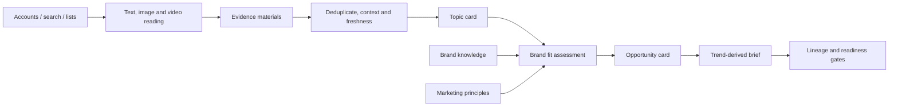

# TrendFit

**From cultural signals to evidence-backed brand marketing opportunities**

TrendFit 是一个品牌热点营销 Agent：持续捕捉社交平台与行业中的文化信号，理解内容语境和生命周期，判断品牌是否有参与资格，并把合适的热点转化为可追溯、可执行、可复盘的营销机会。[中文项目描述](PORTFOLIO_DESCRIPTION.md)

TrendFit explores one question: when a topic is popular, should a specific brand actually join it?

The prototype separates external evidence from marketing judgment, then requires every proposed brief to trace back to a topic card and source material. It is demonstrated with a hypothetical Petlibro China-entry scenario. No real China launch, local SKU, price, service, or campaign approval is assumed.

> Current milestone: the evidence-to-brief core workflow has been validated as a human-in-the-loop MVP. Multi-platform discovery, model orchestration, evaluation, and the product dashboard form the next build stages.

**Current version: v0.2.4.** The Agent core now projects the Petlibro/Nayuki cross-brand run into stable JSON views for a web demo, with append-only human feedback kept separate from model decisions. See the [web data contract](docs/V0.2.4_WEB_DATA_CONTRACT.md), [cross-brand workflow](docs/V0.2.3_CROSS_BRAND_WORKFLOW.md), and [product roadmap](docs/PRODUCT_ROADMAP.md). Project changes are tracked in the [changelog](CHANGELOG.md); GitHub commits and version entries are the delivery record for future outputs.

## Why this project

Most trend tools stop at ranked topics. Brand teams still need to know:

- what the topic means in its original context;
- whether it is current, growing, tired, ironic, or disputed;
- why the brand has permission to participate;
- what would make users remember the brand;
- whether a brief preserves the original participation motive.

TrendFit treats “no recommendation” and “rework” as valid outcomes.

## Product capability blueprint

| Layer | Capability | Intended output |
| --- | --- | --- |
| Trend radar | Monitor priority accounts, keywords, rankings, cultural moments, and category signals across platforms | New topic candidates with source and time evidence |
| Multimodal intelligence | Read text, images, video, audio, and comments; deduplicate sources; identify context, lifecycle, and counter-signals | Structured evidence bundle and topic card |
| Brand brain | Maintain brand positioning, audience, product facts, claims, permissions, and risk boundaries | Versioned brand knowledge and participation constraints |
| Strategy agent | Evaluate consumer motive, brand relevance, brand memory, creative potential, timing, and reputational risk | Recommendation, rejection, or rework with reasons and counterarguments |
| Delivery and learning | Generate opportunity cards and trend-derived briefs; record human decisions and campaign feedback | Executable brief, validation metrics, and an improving evaluation set |

The long-term product is a reusable decision system for different brands: it helps teams detect opportunities earlier, explain why a brand should or should not participate, and move from cultural context to a creative brief without losing evidence along the way.

## Workflow



The code enforces boundaries that are easy to lose in an LLM workflow:

- a case-study method cannot replace an external trend source;
- signed URL variants do not become multiple independent sources;
- a single engagement snapshot cannot prove topic growth;
- missing images and stale upstream versions block promotion;
- good brand fit cannot convert an unverified topic into a ready brief;
- model output never authorizes publication.

## Run the public demo

Python 3.10+ is enough; runtime code uses only the standard library.

```bash
python -m trendfit.cli examples/petlibro_demo.json
python -m trendfit.cross_brand examples/cross_brand_demo.json
python -m trendfit.views examples/cross_brand_demo.json --output /tmp/trendfit-web-data
python -m unittest discover -s tests -v
```

Expected demo status:

```json
{
  "valid": true,
  "brief_status": "draft_unverified",
  "qualified_hot_brief": false,
  "semantic_truth_verified_by_code": false
}
```

## MVP milestone

The current MVP validates the full object chain from source evidence to topic card, brand assessment, opportunity card, and brief. It can preserve source lineage, distinguish a marketing method from a live topic, surface counter-context, downgrade an unsuitable idea to `rework`, and prevent unverified popularity from being presented as a qualified trend.

The v0.2.3 demonstration adds a reusable advertiser profile and a complete brand-by-topic matrix. Petlibro and Nayuki receive different decisions from the same synthetic China-market topic pool; the code checks that topic facts remain brand-independent and that rejected or unverified candidates cannot become executable briefs.

The v0.2.4 data layer exports brand, trend, opportunity, Brief, feedback, and validation views for the upcoming web demo. A manifest records version lineage and content hashes, while append-only feedback preserves the original model assessment.

This repository publishes the reusable logic and a synthetic example. Raw social-media media, signed links, private research, account data, local paths, and credentials are deliberately excluded.

## AI collaboration

- **Human:** framed the business problem, chose the brand scenario, supplied initial source anchors, and corrected product and marketing assumptions.
- **AI agent:** read and structured evidence, implemented the workflow, produced reasons and counterarguments, and ran deterministic tests.
- **Tools:** Codex GPT coding agent for reasoning and implementation; Agent Reach for source access; local Apple Vision OCR for image and sampled video text.

The model provides semantic interpretation. Python checks IDs, sources, versions, states, and permissions; it does not pretend to verify meaning or popularity by itself.

## Roadmap

- **Phase 1 — Decision foundation:** evidence contracts, topic and brand objects, traceable opportunity cards and briefs, version gates, deterministic validation, and a working demo.
- **Phase 2 — Agent core:** reusable brand profiles, trend objects, opportunity decisions, briefs, run history, feedback, and frontend view data are now represented in the public MVP.
- **Phase 3 — Web demo (next):** deliver a clickable trend feed, advertiser workspace, brand-specific opportunity ranking, evidence view, and Brief workspace.
- **Phase 4 — Live operation:** add stable source adapters, refresh jobs, model orchestration, evaluation, and feedback learning. See the [full roadmap](docs/PRODUCT_ROADMAP.md).

## Public-data note

The example is synthetic and the product scenario is hypothetical. Evaluate platform terms and content rights before connecting real collection adapters or using outputs commercially.

## License

[MIT](LICENSE)
