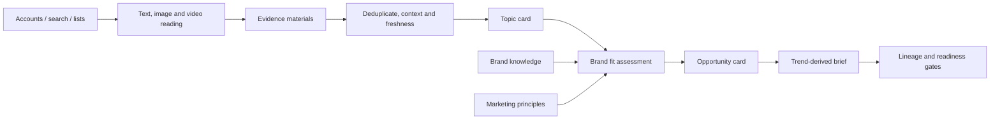

# TrendFit

**Evidence-first brand trend marketing agent prototype**

一个面向品牌营销的热点判断Agent雏形：从外部话题出发，理解语境和时效，判断品牌是否适合参与，再生成可回溯的机会卡和Brief。[中文项目描述](PORTFOLIO_DESCRIPTION.md)

TrendFit explores one question: when a topic is popular, should a specific brand actually join it?

The prototype separates external evidence from marketing judgment, then requires every proposed brief to trace back to a topic card and source material. It is demonstrated with a hypothetical Petlibro China-entry scenario. No real China launch, local SKU, price, service, or campaign approval is assumed.

> Status: human-in-the-loop prototype. Source collection is manual and bounded; semantic review happens with an interactive AI agent. No autonomous publishing, media buying, or always-on monitoring is included.

## Why this project

Most trend tools stop at ranked topics. Brand teams still need to know:

- what the topic means in its original context;
- whether it is current, growing, tired, ironic, or disputed;
- why the brand has permission to participate;
- what would make users remember the brand;
- whether a brief preserves the original participation motive.

TrendFit treats “no recommendation” and “rework” as valid outcomes.

## Workflow



The code enforces boundaries that are easy to lose in an LLM workflow:

- a case-study method cannot replace an external trend source;
- signed URL variants do not become multiple independent sources;
- a single engagement snapshot cannot prove topic growth;
- missing images and stale upstream versions block promotion;
- good brand fit cannot convert an unverified topic into a ready brief;
- model output never authorizes publication.

## Run the public demo

Python 3.10+ is enough; runtime code uses only the standard library.

```bash
python -m trendfit.cli examples/petlibro_demo.json
python -m unittest discover -s tests -v
```

Expected demo status:

```json
{
  "valid": true,
  "brief_status": "draft_unverified",
  "qualified_hot_brief": false,
  "semantic_truth_verified_by_code": false
}
```

## What was tested in the working prototype

The internal research prototype processed six source posts, 18 images, and a 44.334-second video using local frame sampling and OCR. A counter-context review changed the sample recommendation from `research_worthy` to `rework`: asking people to track and display daily life risked recreating the performance pressure expressed by the topic.

This repository publishes the reusable logic and a synthetic example. Raw social-media media, signed links, private research, account data, local paths, and credentials are deliberately excluded.

## AI collaboration

- **Human:** framed the business problem, chose the brand scenario, supplied initial source anchors, and corrected product and marketing assumptions.
- **AI agent:** read and structured evidence, implemented the workflow, produced reasons and counterarguments, and ran deterministic tests.
- **Tools:** Codex GPT coding agent for reasoning and implementation; Agent Reach for source access; local Apple Vision OCR for image and sampled video text.

The model provides semantic interpretation. Python checks IDs, sources, versions, states, and permissions; it does not pretend to verify meaning or popularity by itself.

## Current scope

Implemented: evidence objects, URL normalization, snapshot comparison, lineage validation, topic/assessment/brief version gates, and CI tests.

Next: a small fixed-source discovery pilot, cross-day observations, stronger source independence checks, audio transcription, and evaluated model/API orchestration.

## Public-data note

The example is synthetic and the product scenario is hypothetical. Evaluate platform terms and content rights before connecting real collection adapters or using outputs commercially.

## License

[MIT](LICENSE)
