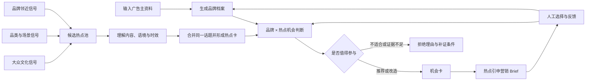

# v0.2.1｜营销热点发现 Agent 工作流设计

## 这一版要解决什么

v0.2.1 先搭建一个完整的能力框架：当系统接到一个新的广告主时，怎样从外部世界发现营销热点，怎样理解热点，再判断这个品牌是否值得参与。

这一版不追求把每个采集器、账号和模型步骤都做完，也不把工作流限定在 Petlibro 或宠物品类。Petlibro 只是第一个验证案例；品牌、品类、目标人群和业务目标都应该能够替换。

## 产品的两个独立输入

### 品牌输入

广告主进入系统后，先形成一份可更新的品牌档案：

- 品牌定位、核心人群和目标市场；
- 品类、产品能力和真实卖点；
- 当前营销目标与希望解决的问题；
- 可以参与的文化角色、不能使用的承诺和风险边界；
- 已确认事实与仍待确认的信息。

不同品牌使用同一套结构。系统不在代码中写死宠物、人群或具体产品逻辑。

### 外部热点输入

热点池独立于具体品牌存在，分成三个观察面：

1. **大众文化信号：** 社会情绪、生活方式、流行表达、娱乐事件、平台内容玩法和重要时间节点。
2. **品类与场景信号：** 某个品类中的新需求、用户矛盾、消费变化、使用场景和行业事件。
3. **品牌邻近信号：** 与品牌人群、价值观、产品能力和竞争环境相关的讨论。

系统先理解外面发生了什么，再做品牌匹配。不能因为当前服务宠物品牌，就只采集宠物内容。

## 大 Agent 的核心工作流

这套工作流包含六种核心能力：

1. **品牌理解：** 把任意广告主资料转成统一品牌档案。
2. **热点雷达：** 从多个观察面持续获得候选，而不是等用户逐条提供链接。
3. **内容理解：** 识别文字、图片和视频表达的真实含义、情绪、玩法与争议。
4. **热点判断：** 判断它是不是外部热点、处于什么阶段、证据是否充分。
5. **品牌适配：** 解释特定品牌为什么有资格参与、能留下什么品牌记忆、可能造成什么风险。
6. **方案生成与学习：** 输出机会卡和 Brief，并让人工选择持续改进后续判断。

## 来源体系怎样设计

现有小红书博主给我们的价值，是帮助识别“来源角色”，而不是成为固定账号清单。未来可以按以下角色扩展不同平台和品类：

| 来源角色 | 用途 |
| --- | --- |
| 热点观察者 | 提供新话题、流行表达和文化变化线索 |
| 创意与案例观察者 | 提供品牌事件案例及可复用的营销机制 |
| 垂直品类观察者 | 发现行业变化、消费需求和真实使用场景 |
| 普通用户与评论区 | 核对话题的自然用法、参与动机和反对声音 |
| 平台榜单与搜索 | 扩大覆盖面，观察话题是否跨账号或跨圈层扩散 |
| 时间节点与外部事件 | 提前发现节日、赛事、发布、社会事件等机会窗口 |

具体账号、关键词和平台接口后续作为可配置的“来源包”补充。更换品牌时，系统保留大众文化来源，并根据新品牌自动换用品类与品牌邻近来源。

## v0.2.1 的输出

这一版交付的是设计骨架：

- 一套可适配不同品牌的品牌输入结构；
- 大众文化、品类场景、品牌邻近三层热点发现逻辑；
- 从候选热点到机会卡和 Brief 的完整流程；
- 来源角色设计，供后续逐步补充账号和平台；
- 推荐、改造、不推荐、待补证四类判断出口。

后续版本再逐步实现来源配置、实际采集、多模态读取、话题聚类、时效观察和自动运行。每一项能力可以单独迭代，但都服务于这套统一框架。

## 设计原则

- **品牌可替换：** Petlibro 是样本，不是系统边界。
- **品类可扩展：** 宠物、美妆、食品、汽车或互联网服务使用同一主流程。
- **热点与品牌分离：** 热点事实不会因品牌不同而改变，品牌适配结论可以不同。
- **发现与案例分离：** 营销案例帮助设计方案，但不能代替实时热点证据。
- **允许拒绝：** 系统的价值包括识别不该追的热点。
- **全程可解释：** 每个机会都能回答热点从哪里来、为什么适合这个品牌、什么情况下不应执行。
