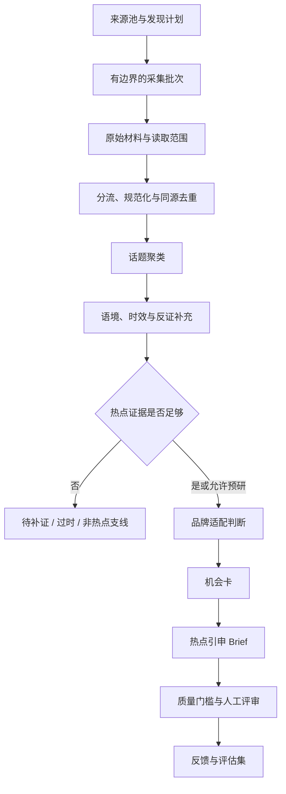

# 第二阶段：热点发现与证据工作流

版本：v0.2.0

## 阶段定位

第一阶段已经固定了主链路的数据关系：外部材料 → 热点卡 → 品牌营销判断 → 机会卡 → 热点引申 Brief，并用规则阻止案例、常青创意和日历策划冒充实时热点。

第二阶段的目标是让系统能够**主动发现新候选，并稳定地把零散、多模态、时效不一的内容加工成可评审的热点卡**。本阶段仍保留人工最终决策；是否找到“推荐”不是验收条件，识别过时、同源、缺证或不适合品牌的候选同样是有效结果。

## 需要建设的八项能力

| 顺序 | 能力 | 需要设计的问题 | 固定输出 | 验收标准 |
| --- | --- | --- | --- | --- |
| 1 | 热点发现策略 | 监测哪些账号、关键词、榜单和时间节点；怎样兼顾广泛文化信号与宠主需求 | `source_catalog`、`collection_plan`、批次清单 | 一次最多 35 条的小批次能主动发现新候选；每条保留发现来源和采集时间 |
| 2 | 采集与来源适配 | 各平台怎样调用、限流、记录失败；怎样避免一次失败让整批中断 | 原始响应、任务 manifest、错误状态、内容哈希 | 成功、空结果、超时、不可解析、权限失败可区分；旧证据不被覆盖 |
| 3 | 多模态完整读取 | 正文、组图、视频画面、音轨和评论分别读到什么程度 | `reading_coverage`、OCR/字幕、媒体定位 | 缺图、只读封面、未转写音轨必须显式标记，不能声称“全文理解” |
| 4 | 资料分流与去重 | 一条材料属于热点线索、营销案例、理论、日历还是常青内容；同一内容的不同链接怎样合并 | 标准化材料、canonical key、材料角色 | 签名参数与转载不制造虚假独立来源；非热点材料进入支线库 |
| 5 | 话题聚类与语境理解 | 不同说法是否属于同一话题；原意、情绪、参与玩法、争议和反讽是什么 | topic cluster、语境摘要、正反证据 | 每个话题可回到具体材料位置；模型结论和原始证据分开保存 |
| 6 | 时效与热度核验 | 如何区分刚出现、增长、成熟、疲劳、反转和过时 | 时间快照、独立来源关系、`heat_status` | 单帖互动不等于话题增长；跨时间、跨来源证据不足时保持未核验 |
| 7 | 品牌适配与 Brief 交接 | 何时调用品牌知识和营销原则；怎样保证创意保留热点动机 | 营销判断卡、机会卡、Brief、反对理由 | 推荐、改造、待补证、不推荐均可输出；每份热点 Brief 可追溯到热点卡 |
| 8 | 运行、评审与反馈 | 每步如何重跑、恢复、记录版本；人工修改怎样沉淀而不覆盖模型意见 | run manifest、评审队列、反馈记录、评估样本 | 输入、输出、模型/规则版本、耗时和失败原因可复查；人工与模型结论并存 |

## 工作流设计

系统按“证据门槛”推进对象，不用一个综合分数掩盖关键缺口：热点很强但品牌无资格时不推荐；品牌很相关但热度未知时只能形成待核验草稿。

## 建设节奏

### v0.2.1｜发现批次

- 把来源目录与搜索词转成可执行计划。
- 完成固定账号、广泛文化和宠主场景三类入口的小批次。
- 输出标准化 manifest、原始响应和初步材料分流。

### v0.2.2｜内容理解与聚类

- 建立正文、图片、视频画面、音轨、评论的读取覆盖约定。
- 增加材料标准化、同源关系和候选话题聚类。
- 为每个候选输出“已读范围、语境摘要、缺口和反对证据”。

### v0.2.3｜时效核验

- 对少量高潜候选保存跨天快照。
- 检查独立来源、传播扩散、疲劳和反转信号。
- 形成明确的热点状态与升级条件。

### v0.2.4｜一键评审批次

- 串联发现、读取、聚类、补证、品牌判断和交付。
- 增加任务状态、失败恢复、版本影响检查和人工评审队列。
- 建立第一组回归样本：热点/案例、有关/无关、上升/过时、完整/缺图、正向/反讽。

## 当前优先任务

下一版先做 **v0.2.1 发现批次**。从既有锚点账号、广泛文化搜索和宠主生活场景中取得最多 35 条材料，完成分流与去重，再选少数候选进入完整读取。旧话题可以继续补快照，但不阻塞新话题发现。

## 暂不放入第二阶段的事项

定时运行、长期告警、独立模型服务、可视化品牌工作台和真实投放效果闭环属于第三阶段。第二阶段会为这些能力保留状态、版本和接口，不把尚未实现的能力写成当前成果。
