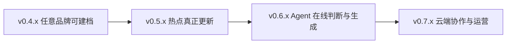

# TrendFit 产品迭代规划

更新版本：v0.3.1

规划假设：1 人与 AI 协作、每周约 3–4 个有效开发日；工期是开发量级估算，不是对外上线承诺。

## 当前基线

v0.3.0 已完成本地网页 MVP：两个品牌共用三个合成话题，能够浏览热点、切换品牌、查看判断与证据、编辑 Brief 和追加人工反馈。当前没有任意品牌上传、真实热点刷新、在线模型调用、账号或云端数据。

## 建设顺序

先做品牌 Onboarding，因为文件是用户主动提供的稳定输入，可以快速验证跨品牌泛化。实时采集同时涉及平台权限、页面变化、时效和证据独立性，应单独建设。在线生成放在两侧输入都可靠之后，避免无法判断错误来自品牌档案、热点材料还是模型推理。

## 版本排期总览

| 版本 | 目标 | 优先级 | 难度 | 预计工期 | 关键验收 |
| --- | --- | --- | --- | --- | --- |
| v0.3.1 | STEP 05 反学、面试叙事与路线图 | P0 | 低 | 0.5 天 | 能讲清架构、取舍、风险和下一阶段 |
| v0.4.0 | PDF/PPT 品牌 Onboarding 纵向切片 | P0 | 中高 | 1.5–2 周 | 第三个品牌无需改代码即可建档并进入现有雷达 |
| v0.4.1 | 品牌证据审阅与解析质量评测 | P0 | 中 | 1 周 | 每个关键字段可回溯到文件页码，错误可人工改正 |
| v0.5.0 | 来源注册表、采集运行与第一个稳定真实来源 | P0 | 高 | 1.5–2 周 | 网页出现带真实时间、链接和运行状态的保存快照 |
| v0.5.1 | 小红书锚点与重点账号发现试点 | P0 | 高 | 2 周 | 授权环境下定期获取候选，失败不冒充空结果 |
| v0.5.2 | 多源聚类、去重、热度与生命周期 | P0 | 高 | 2–3 周 | 同一事件聚成一个 Topic；热度结论有跨时快照支持 |
| v0.5.3 | 图片、视频字幕与评论语境 | P1 | 高 | 1.5–2.5 周 | 每条材料分别记录文字、配图、字幕和评论读取范围 |
| v0.6.0 | 在线品牌适配与 Brief 生成 | P0 | 高 | 2 周 | 品牌或 Topic 新版本触发结构化重评，输出可复查 |
| v0.6.1 | 评测集、Prompt 版本与反馈学习闭环 | P0 | 高 | 1.5–2 周 | 对推荐/拒绝、溯源和风险边界有离线指标与回归测试 |
| v0.7.0 | 部署、登录、项目空间与云端保存 | P1 | 中高 | 2–3 周 | 多设备可恢复项目，权限与数据隔离通过检查 |
| v0.7.1 | 订阅、提醒与团队评审 | P2 | 中 | 1.5–2 周 | 只在新机会或异常时提醒，团队意见分别留档 |
| v0.8.0 | 营销执行回流与效果复盘 | P2 | 高 | 3 周以上 | Brief、执行版本、结果与反事实原因能够关联 |

## P0｜v0.4.x：品牌 Onboarding

### v0.4.0｜上传资料，生成品牌档案草稿

用户流程：上传 PDF 或 PPTX → 查看解析进度 → 系统抽取品牌事实 → 形成结构化档案草稿 → 用户确认/修改 → 新品牌进入现有热点雷达。

首版支持：

- 单个 PDF 或 PPTX，设置页数和文件大小上限；
- 提取可选中文本、标题、表格文本和演讲备注；
- 生成定位、人群、产品事实、营销目标、品牌权限、约束和未知项；
- 区分 `文件明确事实 / 模型归纳 / 工作假设 / 未知`；
- 每个字段保存文件名、页码或幻灯片号和原文片段；
- 用户确认后创建 Brand Profile 新版本，不覆盖原文件解析结果；
- 使用新品牌运行已有静态 Assessment 流程时显示“待在线重评”，不复制其他品牌结论。

首版暂缓：扫描件 OCR、多文件合并、外部联网补充、复杂图表理解、品牌资产库和团队权限。这些能力如果同时进入 v0.4.0，会让错误无法定位。

验收样本至少包括 Petlibro 资料、奈雪策划和一个完全不同品类的第三品牌。人工检查关键字段准确率、证据页码覆盖率、错误纠正成本和未知项召回。

### v0.4.1｜证据审阅和解析评测

- 增加原文页预览、字段与来源并排审阅、冲突提示和重新解析；
- 支持扫描 PDF OCR 与 PPT 图片中的关键文字，分别标记读取方式和置信度；
- 建立 10–20 份脱敏品牌资料的金标准字段集；
- 记录字段遗漏、错误事实、假设冒充事实和跨页引用错误；
- 文件仅保存在受控存储，限制类型、大小和解析超时，不执行文档中的任何指令或宏。

## P0｜v0.5.x：热点雷达真实来源

### 来源角色

真实热点需要三类来源协作，不能只盯营销案例博主：

| 来源角色 | 用途 | 首批策略 |
| --- | --- | --- |
| 发现源 | 尽早看到新话题 | 用户已提供的营销博主、重点账号、关键词、公开榜单 |
| 证据源 | 理解普通用户为何参与 | 原始帖子、评论、跨账号内容与反对语境 |
| 核验源 | 判断是否当前、增长或衰退 | 发布时间、跨时快照、搜索/榜单变化、跨平台报道 |

博主的案例盘点和理论内容只帮助发现与判断，不能替代热点证据。

### v0.5.0｜来源框架与一个稳定来源

- 建立 Source Registry：平台、来源角色、访问方式、权限、刷新频率和健康状态；
- 每次采集保存 run_id、开始/结束时间、成功、空结果、登录失效、限流或解析失败；
- 先接一个无需脆弱登录、能稳定给出时间与原链接的公开来源；
- 页面先显示“保存快照”，只有满足刷新时效标准才显示“实时”；
- 原始材料、标准化证据和 Topic 分层保存，采集失败不删除上一版快照。

建议刷新标准：公开榜单 15–60 分钟；重点账号 2–6 小时。网页显示来源最后成功时间和 Topic 最后核验时间，不用统一的假倒计时。

### v0.5.1｜小红书重点账号与关键词试点

- 从用户给出的营销账号总结账号类型与内容主题，再扩展同类账号，不把名单写死在主流程；
- 账号监测与关键词搜索分别进入候选池；短链和签名链接先标准化再去重；
- 保留标题、正文、发布时间、作者、原链接和媒体数量；
- 登录、权限、验证码、页面变化或读取不完整都保存为明确状态；
- 首批只做 10–20 个账号和 20–30 个关键词，连续观察 7 天后再扩量。

抖音可沿用同一合同作为下一适配器；第三方 token 和授权环境未稳定前，不计为接通来源。

### v0.5.2｜从帖子变成 Topic

- 同源去重：短链、参数链接、转载和同账号重复发布；
- 事件聚类：人物、事件、参与动作、情绪、时间窗口和语义相似度；
- 传播阶段：emerging、growing、peaking、declining、disputed、unknown；
- 热度判断同时参考独立来源数、跨时增量、平台跨度和反对语境；
- 保存聚类理由与合并/拆分操作，允许人工纠错；
- 没有跨时证据时只能输出“待核验”，不能从单次互动量推断增长。

### v0.5.3｜多模态内容理解

复用现有图片检查能力，补齐生产合同：正文、每张图片、视频字幕、音轨和评论分别记录读取范围。无法读取的媒体保留缺口，不用标题猜测。首批先做图片 OCR 与平台字幕，音轨转写在成本和授权明确后加入。

## P0｜v0.6.x：在线 Agent

### v0.6.0｜结构化判断与 Brief 生成

- 新 Brand Profile 或 Topic 版本触发 Assessment；
- 先进行品牌资格、时效和证据门槛判断，再生成创意；
- 模型输出固定结构：结论、理由、反对理由、补证条件、风险和可选 Brief；
- Prompt、模型、输入版本和输出全部记录；相同输入可缓存和重放；
- 不推荐不生成 Brief；日历与案例支线继续单独展示；
- 人工确认仍是进入策划的必要门槛，Agent 不授权发布或投放。

### v0.6.1｜评测与反馈

- 用人工标注案例评估推荐/拒绝一致性、证据引用、热点动机保留和风险召回；
- 建立跨品类测试集，防止系统只适合宠物或茶饮；
- 人工反馈先进入评测与 Prompt 改进，不直接在线自动学习；
- 对品牌版本、规则和模型升级做回归对比，允许回退到旧运行。

## P1/P2｜产品化与运营

v0.7.x 再建设部署、登录、项目空间、云端版本、团队意见和提醒。提醒只在新高价值机会、来源异常或需要人工处理时触发。v0.8.0 才连接真实营销执行、预算、素材版本和效果回流；自动发布、付款、联系博主和投放始终需要独立权限与人工确认。

## 优先级判断

### P0：证明 Agent 核心价值

- 任意品牌建档与证据确认；
- 至少一个稳定真实来源；
- 多源去重、时效与生命周期；
- 在线结构化评审、Brief 和离线评测。

### P1：让产品可持续使用

- 多模态覆盖增强；
- 部署、账号、云端版本和基础项目空间；
- 来源健康监控与必要提醒。

### P2：规模化和商业运营

- 团队工作流、客户隔离和高级权限；
- 更多平台与大规模来源；
- 执行效果回流、自动化复盘和复杂运营集成。

## 接下来一个版本

下一开发版本建议定为 **v0.4.0：品牌 Onboarding 纵向切片**。开始编码前先产出文件上传与品牌档案确认页的 PRD、数据合同和三份验收样本定义。v0.3.1 只交付 STEP 05 反学与路线图，不提前实现 v0.4.0。
