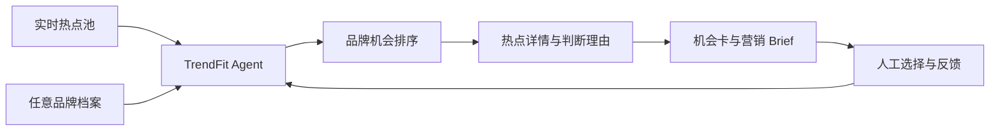

# v0.2.2｜TrendFit 产品路线与阶段 2 建设目标

## 最终产品形态

TrendFit 要做成一个面向品牌团队的网页 Agent。网页聚合当下的热点信号，用户可以输入或切换广告主，系统据此重新判断热点与品牌的匹配关系，并输出机会卡和热点引申营销 Brief。

它需要回答四个连续问题：

1. **现在发生了什么？** 热点来自哪里、处于什么阶段、原始语境是什么。
2. **它会怎样影响品牌？** 相关人群、消费情绪、品类场景和潜在风险有什么变化。
3. **这个品牌该不该参与？** 品牌是否有资格、有作用、有记忆点，并说明反对理由。
4. **如果参与，具体怎样做？** 给出保留热点动机的营销 Brief、验证指标和退出条件。

## 整体阶段

| 阶段 | 目标 | 用户最终能看到什么 | 当前状态 |
| --- | --- | --- | --- |
| 阶段 1：判断基础 | 证明热点、品牌判断和 Brief 可以分开且可追溯 | 一个有来源关系的端到端样本 | 已完成 MVP |
| 阶段 2：Agent 产品内核 | 让同一套工作流支持不同品牌、不同品类和不同热点 | 可供网页调用的稳定对象、判断流程和演示数据 | 当前阶段 |
| 阶段 3：网页 Demo | 把热点浏览、品牌输入、推荐理由和 Brief 生成做成可点击体验 | 类似热点信息站的品牌营销 Agent Demo | 待建设 |
| 阶段 4：实时化与迭代 | 接入可用来源、刷新任务、监控、评估和反馈学习 | 持续更新的热点池及可复查的推荐版本 | 后续建设 |

## 阶段 2 的核心目标

阶段 2 不要求一次接齐所有平台，也不要求每个自动化环节都成熟。它要先固化 Agent 的产品内核：

> **同一份热点池输入不同品牌后，系统能够给出不同、可解释、可追溯的机会判断，并生成对应的营销 Brief。**

阶段 2 需要固化六部分。

### 1. 通用品牌档案

把广告主资料转成统一结构，包括品牌定位、品类、人群、市场、产品事实、营销目标、文化角色和风险边界。Petlibro 只是测试数据；后续加入新品牌时不修改主流程。

### 2. 通用热点对象

统一记录热点的标题、原意、来源、时间、涉及人群、内容玩法、争议、传播阶段和证据缺口。热点事实独立于品牌保存，同一个热点可以被多个品牌重复评估。

### 3. 热点发现与理解接口

先定义来源进入系统后的统一格式和状态，再逐步增加账号、搜索、榜单或平台连接。来源数量不是阶段 2 的验收标准；重点是未来新来源可以接入同一流程。

### 4. 品牌机会判断 Agent

Agent 组合品牌档案和热点对象，判断人群交集、品牌参与资格、品牌作用、传播动机、记忆点、风险及时效，并输出推荐、改造、不推荐或待补证。所有结论都必须带理由和反对意见。

### 5. 机会卡与 Brief 合同

固定网页最终需要展示和导出的内容：热点洞察、品牌机会、核心创意、品牌角色、内容与参与机制、渠道建议、验证指标、风险和退出条件。Brief 必须能回溯到热点与品牌版本。

### 6. Agent 运行与反馈

把一次运行保存为可复查记录：使用了哪个品牌版本、哪些热点证据、哪版判断规则、输出了什么以及人工如何修改。后续网页上的保留、淘汰和修改都会进入反馈记录。

## 阶段 2 的验收方式

阶段 2 完成时，应能用保存的样本数据演示：

- 输入至少两个不同品类的品牌，共用同一批热点候选；
- 同一热点对不同品牌产生不同判断，并能解释差异；
- 热点来源、发布时间、采集时间和证据缺口可以查看；
- 推荐、改造、不推荐、待补证都能进入对应出口；
- 合格机会能生成结构统一但内容不同的营销 Brief；
- 一次完整运行可以重放，旧版本不会被新结果覆盖；
- 输出对象能够直接被网页读取，不需要重新人工整理。

这一步先用公开脱敏样本和合成数据完成，不把“实时抓取已经稳定”写成阶段 2 成果。

## 网页 Demo 的核心页面

阶段 3 的网页 Demo 先设计五个页面，不追求完整商业后台：

1. **热点首页：** 像热点聚合站一样展示当前候选、来源、时间、传播阶段和证据状态。
2. **品牌工作区：** 新建品牌、补充资料、选择本次营销目标。
3. **品牌机会页：** 切换品牌后重新排列热点，展示推荐、改造和不推荐理由。
4. **热点详情页：** 展示原始语境、正反证据、品牌连接和仍待确认的信息。
5. **Brief 工作台：** 生成、编辑和保存机会卡及营销 Brief，并记录人工反馈。

Demo 最关键的交互是“切换品牌”：同一个热点列表会因为广告主不同而改变推荐顺序和判断理由，从而直接体现产品价值。

## 接下来的版本顺序

### v0.2.2｜产品合同与路线

完成本文，统一最终产品、阶段 2 边界、网页所需对象和验收方式。

### v0.2.3｜跨品牌演示内核

建立通用品牌档案、通用热点对象和两种不同品类的演示品牌，让同一热点池跑出不同判断。

### v0.2.4｜Agent 运行包

把品牌输入、热点输入、机会判断和 Brief 输出串成一次可重放的运行，并保存版本、理由、反证和人工反馈。

### v0.3.0｜可点击网页 Demo

先使用保存的热点样本完成热点首页、品牌切换、机会详情和 Brief 页面，验证产品体验。

### v0.3.1｜首个实时来源

接入一个稳定、可说明刷新时间的公开来源。网页区分实时数据、保存快照和合成演示数据，再逐步扩展平台。

## 当前下一步

下一步做 **v0.2.3 跨品牌演示内核**。先选一个与宠物明显不同的第二演示品牌，用同一批热点候选测试：品牌档案能否替换、判断是否真的不同、输出能否直接供网页展示。
