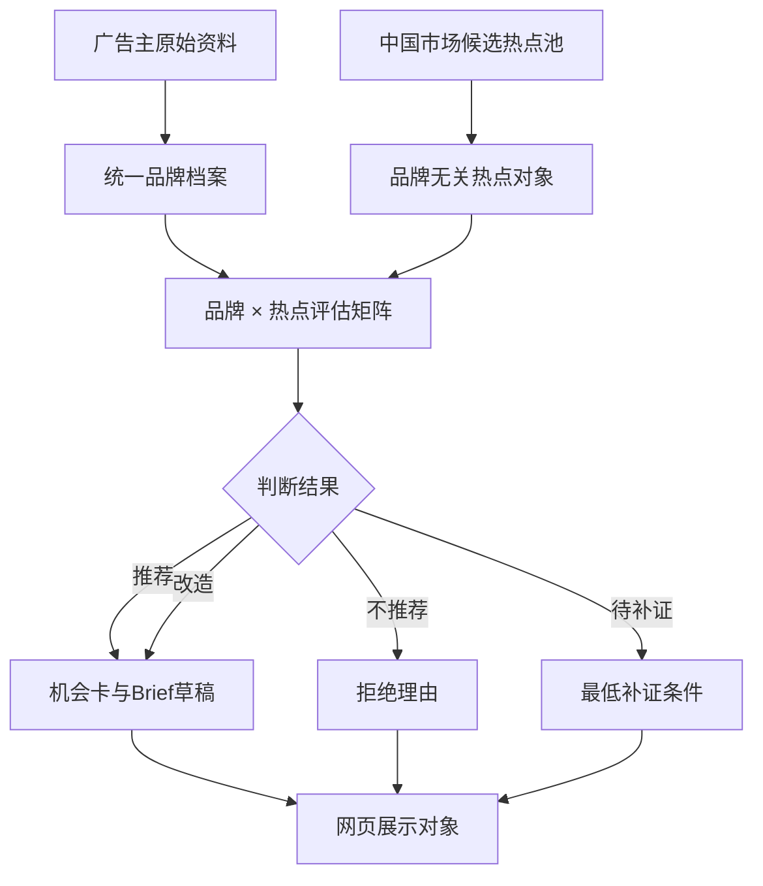

# v0.2.3｜中国市场跨品牌演示内核

## 本版目标

用 Petlibro 与奈雪的茶两个不同品类的品牌，共用同一批候选热点，验证 TrendFit 的品牌工作流能够替换广告主，而不是把宠物营销逻辑写死在系统里。

本版先聚焦中国市场。热点实时采集尚未接通，因此使用公开脱敏信息、用户提供的历史策略资料和合成热点候选验证产品结构。示例中的热点热度均为 `unverified`，营销 Brief 只能是待核验草稿。

## 奈雪资料怎样进入系统

用户提供的 `Naisnow.pdf` 是一份 22 页、2025 年制作的奈雪法国市场进入策划。我们完整检查了页面，并将它定位为**用户历史策略参考**：

- 可作为假设参考：茶饮与烘焙、年轻人城市生活方式、感官体验、轻社交、情绪关怀、季节感、可持续与线下体验。
- 不转成中国市场事实：法国消费者数据、价格、市场规模、门店对标、法国合作方、预算、KPI与具体 campaign。
- 不直接使用的表达：季节饮品健康功效、心理疗愈效果及任何未经品牌确认的产品或服务。
- 原 PDF、页面图片、姓名、学号与其他个人信息不进入公开仓库。

奈雪品牌档案因此保留 `historical_strategy_hypothesis` 状态和明确未知项。后续如果接入品牌官网、财报或广告主填写的信息，再建立新版本，不能静默覆盖这份历史假设。

## 两个品牌共用的工作流



### 第一步：把品牌资料标准化

两个品牌都使用同一字段：

- `positioning`：品牌定位及其证据状态；
- `category` 与 `market`：品类和本次市场；
- `audiences`：核心人群；
- `marketing_goals`：本次业务目标；
- `permissions`：品牌自然有资格参与的文化与场景；
- `constraints`：不能承诺或不能自动执行的事项；
- `unknowns`：会影响判断但尚未确认的信息；
- `source_refs`：档案来自哪里。

### 第二步：热点先独立建档

热点对象不含 `brand_id`。它只记录热点自身的含义、市场、信号层、来源、时效状态和证据缺口。同一个热点版本交给所有品牌评估，避免为迎合品牌改写热点。

### 第三步：生成品牌 × 热点评估矩阵

每个品牌都评估每个候选，形成完整矩阵。当前演示结果：

| 候选热点 | Petlibro | 奈雪的茶 | 为什么不同 |
| --- | --- | --- | --- |
| 下班后十分钟回血 | 不推荐 | 推荐 | 茶饮和门店能直接承接短暂感官休息；宠物科技在该场景缺少自然角色 |
| 长假前的宠物照护安排 | 改造 | 不推荐 | Petlibro与照护安排相关但要核验产品能力；奈雪无法解决核心问题 |
| 不打卡的低压生活 | 改造 | 改造 | 两者都有连接，但Petlibro要避免增加数据任务，奈雪要避免把低压变成消费任务 |

这些结论验证“判断因品牌不同而变化”，不代表三个候选已被确认是当前实时热点。

### 第四步：只为合适出口生成 Brief

`recommend` 和 `rework` 可以生成草稿；`not_recommend` 只保存拒绝理由；`needs_evidence` 保存补证条件。热点未核验时，程序阻止草稿升级为 `ready_for_planning`。

### 第五步：保存一次 Agent 运行

一次运行保存市场、数据模式、品牌版本、热点版本、评估矩阵和 Brief。以后网页切换品牌时读取同一运行包，就能展示不同的推荐顺序和理由。

## 已固化的产品合同

- 两个不同品类的品牌必须使用同一档案结构。
- 品牌事实、策略假设和未知项不能混写。
- 热点事实独立于品牌。
- 每个品牌与每个热点必须有且只有一条评估关系。
- 评估必须包含理由、最强反对意见和证据缺口。
- 不推荐的热点不能生成 Brief。
- 未核验热点不能生成可执行 Brief。
- Agent 输出不能授权发布。

代码只验证对象、版本、关系和状态，不宣称已经自动验证热点语义或热度。语义判断当前由模型与人工共同完成。

## 本版运行

```bash
python -m trendfit.cross_brand examples/cross_brand_demo.json
python -m unittest discover -s tests -v
```

## 下一阶段

v0.2.4 将把当前运行包进一步变成网页可直接消费的数据服务：

1. 生成热点列表、品牌列表、品牌机会详情和 Brief 四类视图数据；
2. 保存人工的保留、淘汰和修改，不覆盖模型原判断；
3. 给每个页面定义稳定字段，为 v0.3.0 网页 Demo 做准备；
4. 暂时继续使用保存样本，网页跑通后再接第一个实时中国来源。
