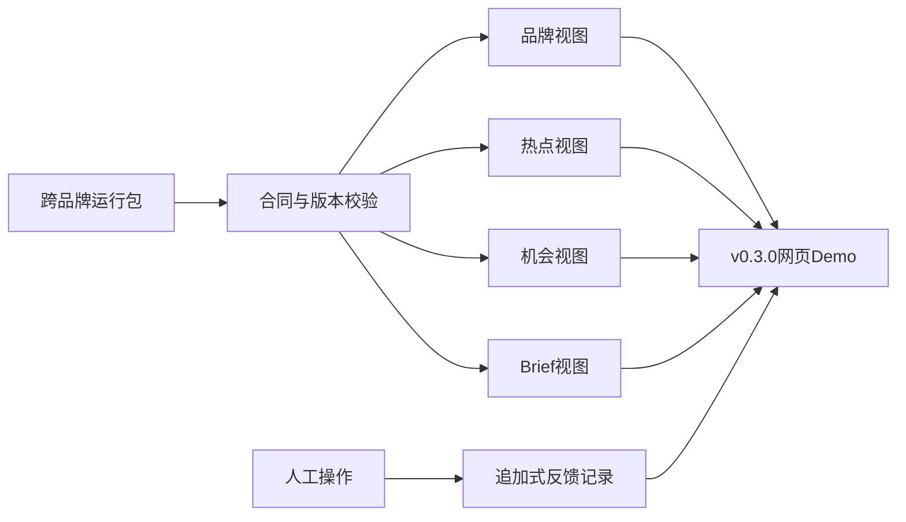

# v0.2.4｜网页数据与反馈合同

## 本版目标

v0.2.4 把跨品牌 Agent 的内部运行包转换成网页可以直接读取的数据。前端不需要理解模型评审文件，只需读取稳定的 JSON 视图，即可展示热点、品牌、机会判断和营销 Brief。

本版仍使用 v0.2.3 的中国市场合成热点。它验证数据流和产品交互，不代表实时采集已经上线。



## 网页读取的六个文件

| 文件 | 对应页面 | 主要内容 |
| --- | --- | --- |
| `brands.json` | 品牌切换器、品牌工作区 | 品牌名称、品类、场景、定位状态、人群、营销目标、未知项数量 |
| `trends.json` | 热点首页 | 热点含义、信号层、时效状态、证据缺口，以及各品牌对应结论 |
| `opportunities.json` | 品牌机会页、热点详情页 | 品牌 × 热点评估、推荐理由、反对理由、补证条件和关联Brief |
| `briefs.json` | Brief工作台 | 核心创意、品牌角色、用户行动、渠道、测量与风险边界 |
| `feedback.json` | 人工评审控件 | 可用动作、必填字段和追加式反馈记录 |
| `validation.json` | 运行状态 | 本次数据是否通过结构、版本和来源关系检查 |

`manifest.json` 记录上述文件的 SHA-256、大小、视图版本和来源运行版本，便于网页确认拿到的是同一批输出。

## 品牌切换怎样工作

`trends.json` 中每个热点包含 `brand_results`。用户切换品牌后，网页根据 `brand_id` 读取对应的判断和 `assessment_id`，再打开 `opportunities.json` 中的完整理由。

因此，热点本身的标题、含义和证据不会变化；变化的是品牌是否适合参与。例如“下班后十分钟回血”对奈雪为推荐，对 Petlibro 为不推荐。

## 人工反馈规则

网页允许四种操作：

- `keep`：保留当前机会；
- `reject`：人工淘汰；
- `request_evidence`：要求补证后再评；
- `edit_brief`：编辑Brief。

每条反馈必须保存反馈ID、评估ID、操作者、动作、理由和时间。反馈只能追加，不能把人工选择写回模型评估、冒充模型原结论。当前公开演示的 `records` 为空，因为用户尚未对这批合成候选作出人工选择。

## 可重放与防覆盖

生成器先重新校验 v0.2.3 跨品牌运行，再投影网页视图。输出目录必须是新的目录，防止旧运行被静默覆盖。所有生成内容使用输入运行中的固定时间，不依赖当前系统时间，因此相同输入可以生成相同输出。

运行方式：

```bash
python -m trendfit.views examples/cross_brand_demo.json --output /tmp/trendfit-web-data
python -m unittest discover -s tests -v
```

公开仓库中的固定演示输出位于 `examples/web_demo_data/`。

## v0.2.4 验收结果

- 2个品牌、3个热点、6条机会判断、4份Brief均进入网页视图；
- 同一热点能在品牌切换后显示不同结论；
- 热点未核验状态和证据缺口完整保留；
- 人工反馈与模型评估分开；
- 生成文件带版本、来源运行和内容哈希；
- 现有测试与新增网页数据测试全部通过。

## 下一步：v0.3.0

直接使用这批静态 JSON 搭建第一版可点击网页：

1. 热点聚合首页；
2. Petlibro／奈雪品牌切换；
3. 品牌机会筛选与判断理由；
4. 热点详情及证据缺口；
5. Brief工作台和本地反馈交互。

网页先验证产品体验，不等待实时来源。页面跑通后，再以独立版本接入第一个稳定的中国市场热点来源。
