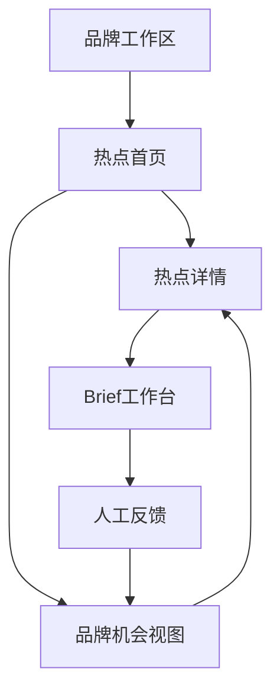

# v0.2.5｜TrendFit 网页 Demo PRD

状态：`draft_for_review`  
市场范围：中国  
演示数据：Petlibro、奈雪的茶、共享合成热点池  
下一实施版本：v0.3.0（需用户确认本PRD后开始）

## 1. 产品概述

TrendFit 是一个品牌热点营销 Agent。它聚合当下值得关注的社会文化、生活方式和品类信号，并根据不同广告主的品牌定位、人群、产品能力和营销目标，判断品牌是否适合参与，进一步输出机会卡与热点引申营销 Brief。

网页 Demo 要让面试官在几分钟内直观看懂三个产品能力：

1. 系统能像热点信息站一样快速浏览候选热点；
2. 切换广告主后，同一个热点会得到不同的推荐结论和理由；
3. 推荐结果可以继续展开为有证据、有反对意见、有风险边界的营销 Brief。

## 2. 产品目标

### 2.1 本版目标

- 用可点击网页完整演示“热点池 × 品牌档案 → 品牌机会 → 营销 Brief”。
- 让用户能在 Petlibro 与奈雪的茶之间切换，看到推荐结果随品牌改变。
- 清楚区分热点事实、品牌适配判断和营销创意。
- 清楚标记实时数据、保存快照与合成演示数据，避免把未核验候选包装成实时热点。
- 支持用户对机会进行保留、淘汰、要求补证或修改 Brief，并保留模型原结论。

### 2.2 本版暂不实现

- 多平台实时采集、定时刷新与后台任务调度；
- 用户登录、团队权限、云端数据库和多人协作；
- 真实广告发布、投放、预算管理或效果归因；
- 自动联系博主、生成合同或发起外部合作；
- 让用户上传任意复杂文件后立即完成全自动品牌研究；
- 将模型判断描述为营销成功概率。

## 3. 目标用户

### 3.1 主要用户

- 品牌市场、社交媒体和内容营销人员；
- 广告公司策略、创意和客户团队；
- 需要快速判断热点是否值得跟进的品牌负责人。

### 3.2 核心任务

用户进入产品时通常要完成以下任务：

- 看今天有哪些值得关注的热点；
- 判断哪些热点与自己的品牌有关；
- 了解系统为什么推荐或拒绝；
- 把合适机会转成可以继续讨论的 Brief；
- 保存人工取舍，供下一轮推荐参考。

## 4. 核心产品原则

- **先看热点，再看品牌：** 热点事实独立保存，不因品牌不同而被改写。
- **品牌可替换：** 页面与工作流不能写死宠物或茶饮品类。
- **理由比总分重要：** 推荐必须展示依据、反对意见和证据缺口。
- **允许没有推荐：** 不合适和待补证都是有效结果。
- **未核验不升级：** 合成候选或热度未知时，只能展示为待核验草稿。
- **人工反馈追加保存：** 人工选择不能覆盖模型原判断。
- **展示产品语言：** 页面优先展示用户能理解的营销判断，技术字段放在次级信息中。

## 5. 核心演示故事

推荐面试演示控制在3至5分钟：

1. 打开热点首页，看到三个中国市场候选及来源、时间和证据状态；
2. 当前品牌选择奈雪的茶，系统优先展示“下班后十分钟回血”；
3. 打开详情，查看为什么适合、最强反对理由以及仍需补充的证据；
4. 进入Brief工作台，查看“今天先缓十分钟”的策略转化；
5. 返回首页切换到Petlibro，同一热点变为“不推荐”；
6. 打开“长假前的宠物照护安排”，查看Petlibro的改造建议和照护风险边界；
7. 点击“要求补证”或“保留”，演示人工反馈与模型原判断并存。

这条故事直接证明产品不是热点榜单，也不是通用文案生成器，而是品牌化的热点决策 Agent。

## 6. 信息架构

Demo采用单页应用体验，包含五个主要界面：

1. 热点首页；
2. 品牌工作区；
3. 品牌机会视图；
4. 热点详情；
5. Brief工作台。

品牌切换器作为全局控件，固定出现在页面顶部。

## 7. 页面需求

### 7.1 热点首页

**目标：** 像热点聚合站一样让用户快速扫视当前候选，同时看到所选品牌的判断。

**顶部区域：**

- 产品名称与一句话说明；
- 当前市场：中国；
- 全局品牌切换器；
- 数据状态说明：合成演示／保存快照／实时；
- 最近更新时间。

**热点卡必须展示：**

- 热点标题与一句话含义；
- 信号类型：大众文化／品类场景／品牌邻近；
- 热点状态：已核验／待核验／过时／争议中；
- 所选品牌的结论：推荐／改造／不推荐／待补证；
- 一条最核心的品牌判断理由；
- 来源数量与主要证据缺口；
- 是否已有Brief。

**筛选和排序：**

- 默认按“品牌机会”分组：推荐、改造、待补证、不推荐；
- 可按信号类型与热点状态筛选；
- 切换品牌后不改变热点事实，只更新品牌结论、理由和Brief状态。

**空状态：** 如果当前品牌没有推荐机会，展示“暂时没有值得追的热点”，并保留改造、待补证和不推荐结果。

### 7.2 品牌工作区

**目标：** 查看和切换广告主，让用户理解系统依据什么做判断。

**v0.3.0必须支持：**

- Petlibro与奈雪的茶两个预设品牌；
- 展示品牌名称、品类、市场、定位、核心人群和营销目标；
- 分开展示品牌参与权限、风险边界和未知信息；
- 显示定位状态：已确认事实／历史策略假设／工作假设。

**演示输入方式：** 使用结构化表单切换和编辑预设品牌副本。用户修改后仅保存在浏览器本地，不改写仓库中的基准数据。

**后续能力：** 新建任意品牌、上传资料、自动研究与品牌档案版本管理不属于v0.3.0。

### 7.3 品牌机会视图

**目标：** 集中查看某个品牌对全部热点的判断。

每条机会展示：

- 品牌与热点名称；
- 判断结果；
- 2至3条适配理由；
- 最强反对意见；
- 最低补证条件；
- Brief入口；
- 人工反馈状态。

用户可以按结论筛选。总数显示各状态数量，不显示伪科学的综合成功概率。

### 7.4 热点详情

**目标：** 让用户核查热点本身与品牌判断之间的关系。

页面分成三个明确区域：

1. **热点事实：** 含义、信号层、市场、发布时间／采集时间、来源、传播状态和证据缺口；
2. **品牌判断：** 所选品牌的参与资格、相关人群、品牌作用、反对意见和改判条件；
3. **方案入口：** 如果结论为推荐或改造，进入Brief；否则展示拒绝理由或补证要求。

合成演示数据必须始终显示明显标记。没有真实链接时不能展示虚构的“查看原文”按钮。

### 7.5 Brief工作台

**目标：** 把品牌机会转成可以继续讨论和编辑的营销方案。

必须展示：

- 关联品牌、品牌版本、热点、热点版本与当前时效状态；
- 热点洞察和品牌机会；
- 核心创意；
- 品牌角色；
- 用户参与方式；
- 推荐渠道；
- 验证指标；
- 风险边界和退出条件；
- 当前状态：待核验草稿／可进入策划。

用户可以编辑文本副本，并执行保留、淘汰、要求补证和保存修改。v0.3.0不调用模型重新生成，也不自动发布。

## 8. 关键交互

### 8.1 品牌切换

- 切换后保留当前热点筛选条件；
- 更新每个热点的品牌结论和理由；
- 当前打开的热点详情同步切换为新品牌判断；
- 如果新品牌对该热点为不推荐，隐藏Brief入口并展示拒绝理由；
- 页面提示“热点事实未改变，品牌判断已更新”。

### 8.2 人工反馈

- `保留`对应 `keep`；
- `淘汰`对应 `reject`；
- `要求补证`对应 `request_evidence`；
- `保存修改`对应 `edit_brief`。

操作时要求填写简短理由。反馈保存在浏览器本地，并显示在该机会的操作记录中。模型原判断始终可查看。

### 8.3 数据状态

页面统一使用三个数据来源标签：

- **合成演示：** 为验证产品结构创建的候选；
- **保存快照：** 来自真实来源但并非当前实时刷新；
- **实时：** 来自已接通来源并显示具体刷新时间。

v0.3.0只启用“合成演示”。另外两种状态先完成视觉和字段预留。

## 9. 视觉与信息表达

- 整体参考热点信息站的高信息密度和快速浏览体验，但形成TrendFit自己的视觉语言；
- 桌面端优先，同时保证常见手机宽度可以阅读；
- 热点标题与品牌结论是首要视觉层级；
- 使用固定颜色区分推荐、改造、待补证和不推荐，同时搭配文字，不能只靠颜色；
- 来源、版本、证据缺口和风险采用可展开的次级区域；
- 不在主界面堆叠JSON、模型名称、规则编号等实现细节；
- Demo中所有可点击元素必须产生明确反馈，不能保留无效按钮。

## 10. 数据映射

v0.3.0直接读取 `examples/web_demo_data/`：

| 页面 | 数据文件 |
| --- | --- |
| 品牌切换器、品牌工作区 | `brands.json` |
| 热点首页 | `trends.json` |
| 品牌机会视图、热点详情 | `opportunities.json` |
| Brief工作台 | `briefs.json` |
| 人工反馈 | `feedback.json` 作为合同，本地存储作为Demo记录 |
| 运行和错误状态 | `validation.json`、`manifest.json` |

网页加载时如果验证状态失败、文件版本不一致或数据缺失，显示数据错误页，不继续展示可能混批的判断。

## 11. 功能优先级

### P0：面试演示必须完成

- 热点首页；
- Petlibro／奈雪品牌切换；
- 品牌结论随切换更新；
- 热点详情；
- Brief展示与本地编辑；
- 四种人工反馈；
- 合成数据与未核验状态标记；
- 桌面端完整演示路径。

### P1：有时间再增加

- 信号类型和结论筛选；
- 手机端布局优化；
- 反馈历史面板；
- 复制或导出Brief；
- 页面过渡与轻量动效。

### P2：后续产品版本

- 新品牌自动研究与上传；
- 真实热点刷新；
- 模型重新判断和生成；
- 用户登录、云端保存和团队协作；
- 真实营销表现回流。

## 12. 验收标准

v0.3.0满足以下条件才算完成：

- 用户在不看说明文档的情况下能找到品牌切换器；
- 切换奈雪与Petlibro后，三个热点的判断与v0.2.3矩阵一致；
- “下班后十分钟回血”对奈雪显示推荐，对Petlibro显示不推荐；
- 不推荐结果没有Brief入口；
- 所有热点都显示 `unverified` 与“合成演示”标记；
- 用户能从热点首页进入详情，再进入对应Brief；
- 用户能保存一条带理由的反馈，刷新页面后仍可查看；
- 人工反馈不会改变模型原判断；
- 数据版本或校验失败时，网页停止展示并给出清晰错误；
- 没有无效按钮、断链、明显布局溢出或控制台错误；
- README包含本地启动方法、演示路径和数据边界。

## 13. 面试展示重点

页面应帮助讲清以下产品判断：

- 热点聚合只是入口，核心价值是品牌适配判断；
- 同一热点对不同品牌可以有完全不同的结论；
- Agent不仅生成创意，也能拒绝硬蹭和提出补证条件；
- 系统保存证据、版本和人工反馈，为未来实时数据与模型服务留下接口；
- 当前Demo诚实展示数据边界，但产品主流程已经可以被体验。

## 14. 待用户确认

开始v0.3.0前，请确认以下产品选择：

1. **首页默认品牌：** 建议默认奈雪的茶，因为“推荐→Brief”的路径更适合第一次演示；Petlibro用于展示切换后变为不推荐。
2. **品牌输入范围：** 建议v0.3.0只支持两个预设品牌的本地编辑，不做任意文件上传和自动研究。
3. **网页语言：** 建议界面以中文为主，关键状态附简短英文，便于中国广告面试展示。
4. **视觉方向：** 建议使用清爽、专业、偏策略工具的界面，避免直接复制AIHOT的品牌设计。
5. **Brief操作：** 建议支持本地编辑、复制和反馈，不接真实模型重新生成。
6. **发布方式：** 建议先完成本地可运行Demo与截图验收，再决定是否部署公开链接。
