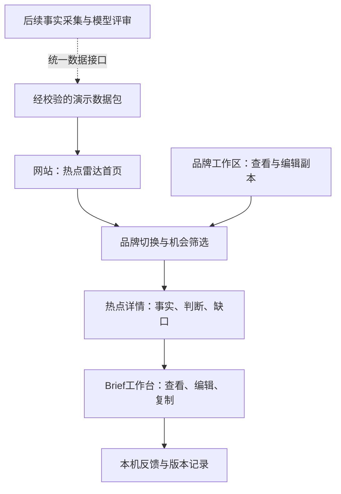

# v0.2.7 · STEP 03：网站架构与实施计划

状态：架构计划完成，等待进入 STEP 04。本文是实施规格，不代表功能已完成。

## 已确认的产品决定

- 采用 B / Radar Room 为唯一主视觉：深绿黑、荧光黄绿、细网格、雷达图形和清晰状态。
- 中国市场；奈雪默认，Petlibro为对照品牌，Petlibro入华仍是假设。
- PRD的预设品牌、本地编辑、中文界面、Brief复制与反馈、本地验收优先均已确认。
- 最终交付是可运行的网站，有页面导航、品牌切换、热点详情和Brief工作台。
- v0.3.0使用合成样本；事实采集作为后续能力持续建设。选定B不意味着已经有实时扫描或模型在线推理。
- 每次交付在GitHub记录版本；旧版本标签不覆盖。网站公开部署需在本地验收后确定。

## 网站结构与核心流程

| 页面地址（计划） | PRD功能 | 完成表现 |
| --- | --- | --- |
| `/` | 热点首页、品牌机会视图 | 默认奈雪；品牌切换、推荐分组、筛选、热点状态及详情入口 |
| `/brands` | 品牌工作区 | 两个完整档案、事实状态、目标、风险、未知项；编辑与恢复副本 |
| `/trends/:id` | 热点详情 | 热点事实与品牌评审分区；来源、读取范围、缺口、最强反对理由 |
| `/briefs/:id` | Brief工作台 | 品牌与热点关联、创意、参与、渠道、验证计划、限制、编辑与复制 |
| 全局反馈抽屉 | 人工决策 | 保留、淘汰、补证、修改；理由必填；刷新后仍存在 |

品牌机会视图复用首页，避免两个列表状态不同步。页面地址通过前端路由实现；具体路由机制适配STEP 04的Sites项目模板，首次架构初始化采用本地模式，不注册或部署线上站点。

## 技术选择与目录边界

建议网站采用React + TypeScript，以组件承载交互、以类型约束数据。STEP 04通过Sites技能选择适合现有仓库的本地项目模板，保留模板包管理器与锁文件，不为使用某个脚手架重建Python项目。静态数据加载、状态管理使用轻量的组件状态与上下文；本版不引入数据库、登录系统或后台服务。

计划在仓库的 `web/` 中隔离网站代码：

- `pages/`：四个页面；
- `components/`：品牌切换器、热点卡、状态标签、证据面板、反馈抽屉；
- `data/`：读取、验证、投影视图的入口；
- `state/`：当前品牌、筛选、编辑副本、追加反馈；
- `styles/`：B风格颜色、字体、间距与动效；
- `public/data/`：经过校验与脱敏的展示数据。

目录为逻辑划分，允许按模板合并小文件。既有Python校验与生成器继续负责数据构建，浏览器不运行采集脚本。网页不直接按品牌名硬编码判断。

## 数据流与必须先补的缺口

现有6类JSON视图和manifest可复用，但不足以完全实现PRD。第一个开发检查点应先升级数据合同：

| 缺口 | 实施要求 |
| --- | --- |
| 品牌视图仅有unknown_count | 增加完整unknowns、constraints、permissions、source_refs及其证据状态 |
| 热点只有source_refs，没有完整来源对象 | 增加sources：类型、标题、可用原链接、证据角色、读取范围；合成来源URL为空 |
| generated_at被当作refreshed_at | 分开显示包生成时间、真实采集时间和发布时间；后两者未知用null，生成时间不冒充刷新时间 |
| 日历/常青与实时热点混在一池 | 增加queue_type：trend_candidate/calendar/evergreen/case；长假照护归日历机会，不计实时热点 |
| Brief缺少独立退出条件与创意溯源 | 增加热点机制、品牌化改造、来源定位、执行缺口及退出条件；草稿标签继承时效状态 |
| 反馈合同尚无写入行为 | 建立本地追加事件和Brief修订结构，校验必填字段、关联ID和输入版本 |
| 一条评估可被重复Brief引用、状态枚举不完整 | 补唯一关系和合法状态校验，防止界面选错Brief或误升级 |

每份页面数据都带run_id、schema/view_version、brand_version和topic_version。启动时验证manifest文件集合、内容哈希、运行与视图版本一致性、ID引用和数据状态；验证失败停止展示业务结论并提供重试。不能仅因为validation.json写了valid就信任全部数据。

## 状态管理：编辑后不会假装重新分析

- 默认品牌奈雪，可切Petlibro；相同热点事实共用一个对象，排序只影响显示。
- 切换品牌时保留筛选；若无结果，说明是筛选导致并提供清除入口。
- 品牌编辑保存本机副本与新修订号；相关旧评估标记“基于原档案，待重评”。不自动编造新分数或新推荐。
- 当前版本的“生成Brief”呈现为“查看示例Brief / 打开Brief草稿”，只展示保存的模型辅助样本。在线生成另接模型后开启。
- Brief编辑产生新副本，并保留原文；品牌切换遇未保存修改，先提供保存/放弃/取消。
- 从Brief页切品牌：若目标品牌有同热点Brief则进入对应草稿；否则回同热点详情，说明无Brief。
- 反馈事件记录event_id、run_id、assessment_id、输入版本、action、reason、created_at、actor_kind和可选brief_revision_id；用户选择永不覆盖模型结论。
- localStorage使用命名空间及存储版本；写入失败显示“未保存”，不能显示成功；损坏记录隔离后允许恢复，不自动丢弃用户修改。
- 本地保存只在当前浏览器有效，页面明确说明。没有账号或跨设备同步。

## B风格如何应用到真实网站

首页以可用的品牌切换器和热点列表为主要工作区域，雷达作为辅助概览，不用巨大宣传标题占据整个首屏。推荐、改造、待补证、不推荐以文字和颜色共同表达；热点状态另列，避免“品牌推荐”等于“实时已核验”。

长Brief采用安静的深色阅读面板，正文不使用密集终端字体。正文约16px，常用标签约14px；雷达动效可关闭并尊重减少动态效果偏好。按钮支持键盘、焦点清晰，窄屏改为单列与可展开详情。

删除方向B里的虚构运行日志、刷新倒计时和未实现的快捷键提示。样本统一显示“合成演示 · 热度未核验”；数据未更新时不做假扫描。后续真实采集中的成功、空结果、登录失效与失败分别显示。

## 事实采集的后续接入

采集运行在受控服务或用户授权的本机环境，经现有平台工具取回材料，不能把登录信息放进网页。

来源配置 → 有边界采集 → 原始材料与媒体覆盖 → 资料分流/同源去重 → 独立热点卡 → 品牌评审 → 校验 → 发布展示包。

展示层只依赖同一读取接口：第一版读取静态JSON；后续切换到只读数据服务。加入真实来源时保存发布时间、采集时间、原链接、阅读覆盖、独立来源关系、失败与证据缺口。新快照产生新版本，不覆盖旧评审。旧材料可以标为保存快照，不能重新贴为实时。接口近期成功不等于话题热度已核验。

第一轮仍以用户提供博主的来源角色作为发现锚点，同时扩展大众文化与不同品类场景；不为奈雪或宠物专门写两套采集和推理流程。音轨、跨天观察和稳定抖音访问等尚未完成的能力继续保留缺口。

## 性能、扩展、安全与运行观察

| 方面 | v0.3.0的选择与验证 |
| --- | --- |
| 性能 | 静态资源、本地字体优先、按路由分离重内容；演示包只加载一次；品牌切换不联网。以常用桌面首屏3秒内可用、切换约200ms内响应为开发目标，实测后记录，不宣称已达到 |
| 扩展 | 品牌与话题按ID关联；增加品牌无需复制页面。后续数据量增加时再引入分页/服务端检索，不预先做微服务 |
| 安全 | 源资料视为不可信文本；不执行文档指令、不渲染任意HTML；外链只允许安全HTTP(S)并隔离新窗口；密钥、PDF、个人信息和原始登录数据不进静态包 |
| 数据可信度 | 未知不填0、同源不计独立来源、日历支线不算热点、历史法国策略不转成奈雪中国事实 |
| 运行观察 | 本地记录加载、校验失败、路由错误和保存失败的错误码；不采集外部遥测或把品牌资料写入日志；用户看到可操作的错误提示 |
| 简化 | 单用户、本机保存、无API调用费用、无云端权限体系。反馈本版仅记录，不宣称模型已自动学习 |

## STEP 04实施检查点

| 检查点 | 具体交付 | 通过条件 |
| --- | --- | --- |
| 1 数据与工程准备 | 补充上述字段与状态约束；初始化本地网站；记录启动方法 | 合成/历史/日历状态不混淆；现有Python规则及新增风险用例通过 |
| 2 第一条可操作路径 | B风格首页、默认奈雪、Petlibro切换、筛选和空状态 | 同一热点分别显示两品牌已保存结论；用户首屏可开始操作 |
| 3 详情与Brief | 完整品牌档案、热点证据面板、Brief详情与路由 | 无真实URL不提供原文按钮；不推荐无Brief；深链刷新可用 |
| 4 本地编辑与反馈 | 品牌草稿、Brief副本、四类反馈、未保存提示 | 刷新保留；模型原判断可查；更改品牌提示待重评；存储错误不报成功 |
| 5 网站验收与交付 | 桌面/窄屏/键盘操作检查、截图、生产构建、README和版本记录 | 端到端演示无死按钮、断链或明显溢出；错误数据包被阻止；本地URL可访问 |

测试聚焦风险：品牌切换串错Brief、版本过时、坏包继续显示、反馈覆盖评审、保存失败、数据状态误标。已有检查通过后不重复扩大测试范围。验收截图使用用户已确认的浏览器QA要求；公开部署在验收后另行确定。

## 本步交付与下一步

v0.2.7交付架构与分步计划、B视觉决定和持续上下文记录；没有创建网站工程、安装依赖或连接事实采集服务。下一步按上述检查点实施v0.3.0。

Vibe Coding要求STEP 03结束后等待明确确认再进入STEP 04。本计划供确认，确认后即可按PRD完成网站功能。
