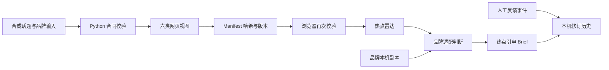

# v0.3.1 · STEP 05：从代码反讲 TrendFit

状态：Vibe Coding STEP 05 完成。本文件帮助项目作者在面试中解释自己做了什么、为什么这样设计，以及下一步如何扩展。

## 一句话产品定义

TrendFit 不是一个热点排行榜或文案生成器。它把外部热点证据与品牌判断分开，让同一个话题面对不同品牌得到不同结论，再把适合参与的机会转成有来源、反对理由和退出条件的营销 Brief。

## 当前架构

这套架构有两层保护：Python 在发布数据包前检查对象关系，浏览器在展示前再次检查文件哈希、版本、跨品牌矩阵和 Brief 来源。如果数据混批或关系不完整，网页停止显示业务结论。

## 四个最重要的产品对象

| 对象 | 回答的问题 | 为什么独立保存 |
| --- | --- | --- |
| Brand Profile | 品牌是谁、能谈什么、什么仍未知 | 品牌变化会让旧评审过时，但不应改写热点事实 |
| Topic | 外部在讨论什么、证据和时效如何 | 同一话题要供多个品牌复用，不能提前品牌化 |
| Assessment | 这个品牌是否适合参与，为什么 | “热不热”和“适不适合”是两个判断轴 |
| Brief | 品牌如何把热点动机转成营销动作 | 必须回溯到品牌、话题和评审版本，不能凭空生成 |

人工反馈是第五类追加事件。它表达用户的保留、淘汰、补证或修改，不覆盖模型当时的原始结论。

## 关键取舍

### 1. 静态数据包，而不是先做实时后端

v0.3.0 要验证的是产品决策链是否成立。静态、可重放的输入让跨品牌演示稳定，也避免把平台连接成功冒充话题热度。代价是网页还不能回答“此刻发生了什么”。v0.5.x 会用只读数据服务替换静态读取层，页面对象保持不变。

### 2. 保存模型辅助样本，而不是现场调用模型

面试演示需要确定性、可审计和低延迟。保存评审样本可以清楚展示模型贡献与代码校验的边界。代价是品牌修改后无法立即重新推理，所以网页明确显示“待重评”。v0.6.0 才接在线评审与 Brief 生成。

### 3. 浏览器本地副本，而不是账号与数据库

本机存储足以验证编辑、修订和人工反馈，并避免在 MVP 中引入登录和权限。代价是不能跨设备或团队共享。云端保存应在核心输入与评审质量稳定之后建设。

### 4. 校验失败时整包停止，而不是尽量显示部分结果

营销判断一旦串错品牌、话题或版本，会比空页面更危险。当前数据量很小，因此选择失败关闭。未来数据量扩大后，可以按运行批次隔离失败，但仍不能展示关系不完整的结论。

### 5. Hash 路由和单一工作区，而不是完整后台

Hash 路由保证本地刷新和分享演示路径简单，单工作区使品牌切换、筛选和未保存状态保持一致。代价是主组件偏大，团队开发与页面级加载不够理想。下一次功能扩展前应先拆分页面组件、数据仓库和导航状态机。

## 从实现得到的技术认识

- `generated_at`、`collected_at` 和 `published_at` 不能混用；生成网页包的时间不代表采集或发布时间。
- “未知”是一种需要展示和阻断升级的状态，不能用 0、空字符串或乐观默认值替代。
- 热点热度与品牌适配相互独立。品牌高度相关的日历场景，也不能因此变成实时热点。
- 品牌档案是评审输入。档案发生修改时，旧 Assessment 和 Brief 应失效或标记过时。
- 来源数量不等于独立证据数量；同源转载、签名链接变体和案例方法论不能重复计数。
- LLM 负责语义理解，确定性代码负责 ID、版本、状态、权限和溯源约束。两者不能互相冒充。

## 当前风险与处理方式

| 风险 | 当前处理 | 后续加强 |
| --- | --- | --- |
| 合成样本被理解成实时热点 | 全站标记“合成演示 / 热度未核验” | 接入真实来源后显示采集时间和来源健康度 |
| 品牌资料被模型过度推断 | 保留事实状态、未知项和来源说明 | 文件级引用、页码证据与人工确认 |
| Brief 脱离热点起点 | 强制保存 topic、assessment、source 引用 | 在线生成时做结构化输出和生成后校验 |
| 人工选择覆盖模型记录 | 反馈追加保存 | 建立带标注者和理由的评测集 |
| 平台采集不稳定 | 当前不宣称接通 | 适配器隔离、失败状态、缓存与降级来源 |
| 前端继续膨胀 | 当前为面试 MVP 的单工作区 | v0.4.0 前拆页面、状态和数据访问层 |

## 如果重新设计一次

我会保留 Brand → Topic → Assessment → Brief 的核心合同，同时把前端拆成四个页面模块、一个版本化数据仓库和一个显式导航状态机；把静态 JSON 与未来 API 放在同一个 repository 接口后面；从第一天建立一小批人工金标准案例，用来评估品牌建档、热点聚类、推荐判断和 Brief 溯源，而不是只测试代码结构。

## 5 分钟面试讲法

### 0:00–0:40｜问题

“热点工具通常告诉品牌什么在热，但没有回答这个品牌该不该参与。TrendFit 的核心是把热点证据、品牌适配和创意 Brief 分成三步，让拒绝硬蹭也成为有效输出。”

### 0:40–2:20｜演示

打开奈雪视角的“下班后十分钟回血”，展示话题含义、未核验证据、推荐理由和最强反对意见；进入 Brief；再切换 Petlibro，展示同一话题变成不推荐且没有 Brief。

### 2:20–3:20｜架构

“热点事实独立保存，每个品牌生成自己的 Assessment。Brief 只能来自推荐或改造结论，并保存品牌、话题和来源版本。Python 和浏览器各校验一次，避免数据混批。”

### 3:20–4:20｜AI 分工

“我让 AI 做资料理解、语义判断和实现；我负责定义问题、选择品牌、纠正实时性与营销逻辑、决定人工反馈不能覆盖模型结论。代码不证明热点真的热，只证明输入输出关系满足产品规则。”

### 4:20–5:00｜下一步

“下一版先把 PDF/PPT 自动建档跑通，再接一个可稳定核验的真实来源，随后增加多源聚类、时效判断和在线生成。每条能力都有单独验收标准，不用一个大版本同时赌文件解析、平台采集和模型质量。”

## 常见追问

**现在是实时的吗？** 不是。当前版本验证可点击的决策工作流，所有样本明确标为合成与未核验。实时来源在 v0.5.x。

**AI 在哪里？** 目前 AI 参与资料结构化、语义评审、理由与 Brief 样本以及代码实现；网页使用保存结果保证可审计。在线推理在 v0.6.0。

**为什么品牌上传放在实时热点之前？** 品牌输入是可控、可评测的依赖。先证明第三个品牌无需改代码即可建档和评审，再接不稳定的外部来源，能更快定位问题来自品牌理解还是热点采集。

**如何避免品牌硬蹭热点？** 判断必须包含品牌作用、反对理由、证据缺口和退出条件。不推荐没有 Brief；修改品牌资料后旧判断变为待重评。

**最需要重构的地方？** 当前前端工作区为快速 MVP 集中实现，下一次功能扩展前要拆分页面、状态机、存储和数据接口，并增加真实案例评测集。
