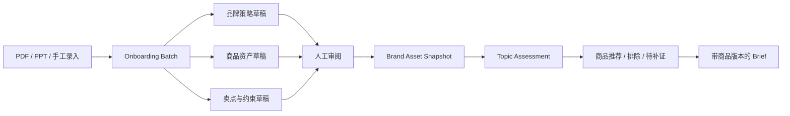

# v0.4.0 品牌资产库与商品 Onboarding PRD

状态：面试适配设计稿，等待评审后进入实现。它扩展 v0.3.1 的下一版本定义，不代表商品库已经上线。

## 1. 为什么现在做

v0.3.0 已证明 `Topic × Brand Profile → Assessment → Brief` 的决策链，但 Brand Profile 目前只有定位、人群、营销目标、参与权限、约束和未知项。系统知道“品牌大致能谈什么”，却不知道“当前有哪些可投、可卖、可证明的具体商品”。因此：

- Assessment 只能给出品牌级相关性，不能解释为什么选某个商品；
- Brief 里的品牌角色无法回溯到在售 SKU、服务范围或已确认卖点；
- `主推产品 / 中国在售 SKU / 价格 / 渠道 / 服务能力` 被混在 unknowns，缺少独立生命周期；
- 品牌档案任何小改动都会让全部判断过时，无法做到资产级影响分析。

v0.4.0 的目标是把“品牌档案”升级为可管理、可核验、可被 Agent 使用的品牌资产工作区，并以商品库完成第一个端到端纵向切片。

## 2. 产品定位

品牌档案回答“这个品牌是谁”；品牌资产库回答“这个品牌此刻能拿什么参与营销”。



TrendFit 不替代 ERP、PIM 或广告投放平台。首版只维护“做营销决策所需的商品事实快照”，并保留与未来外部商品源的映射字段。

## 3. 目标用户与任务

### 主要用户

- 品牌市场或内容营销人员：快速告诉系统当前主推什么、哪些话不能说；
- 代理商策略与创意人员：核查推荐商品及其证据，不依赖口头信息；
- 平台运营或商品运营：发现缺字段、过期商品和渠道冲突；
- 面试演示中的产品经理：说明如何从垂直品牌案例抽象出泛商品平台能力。

### 核心任务

1. 从品牌资料中建立品牌策略和商品资产草稿；
2. 批量审阅系统抽取结果，区分事实、推断、假设与未知；
3. 管理商品从草稿到可用于营销决策的生命周期；
4. 让 Agent 基于具体商品进行选品、排除和补证；
5. 让 Assessment 与 Brief 回溯到不可变的品牌资产快照。

## 4. 范围

### P0：v0.4.0 纵向切片

- 单个 PDF 或 PPTX 上传，也支持使用仓库内合成示例；
- 抽取 Brand Profile、Catalog Item、Variant、Claim、Availability 草稿；
- 品牌资产工作区：品牌概览、商品库、卖点与边界、待补信息、版本记录；
- 商品列表的搜索与状态筛选；
- 商品详情审阅：基本事实、变体、场景/人群、渠道与市场、卖点、风险、来源；
- 字段级来源：文件名、页码/幻灯片号、原文片段、事实状态、人工确认状态；
- 创建不可变 `Brand Asset Snapshot`；
- 在 Assessment 中保存商品选择结果，在 Brief 中保存商品资产版本；
- 商品不可用、证据不足或卖点越界时，阻止其成为可执行 Brief 的主推商品。

### P1：v0.4.1

- 原文页预览、字段与来源并排审阅、冲突合并和重新解析；
- 扫描件 OCR 与 PPT 图片文字，并标记读取方式和置信度；
- 批量导入 CSV/XLSX 商品表；
- 10–20 份脱敏资料的字段抽取金标准与回归评测；
- 单商品变更的影响范围提示与选择性重评。

### 暂不做

- 实时库存、订单、履约、结算和商品主数据治理；
- 直接连接巨量引擎、抖店或其他广告/电商平台；
- 自动创建广告计划、自动调价、自动发布或自动消耗预算；
- 多层组织权限、审批流和云端多人协作；
- 全量 DAM 素材库。首版只保留 `creative_refs` 扩展位；
- 用一个不可解释的综合分数代替事实门槛和选择理由。

## 5. 泛商品抽象

不要把商品模型写死为“有颜色和容量的实体 SKU”。统一把可被营销、选择和交付的对象定义为 `Catalog Item`：

| 商品形态 | Catalog Item | Variant / Offer 示例 | 关键可用性 |
| --- | --- | --- | --- |
| 实体商品 | 智能喂食器产品族 | 白色 / 5L / 京东在售 SKU | 市场、库存或在售状态、售后范围 |
| 餐饮商品 | 季节限定饮品 | 中杯 / 冰度 / 门店售卖项 | 城市、门店、起止日期 |
| 服务 | 上门清洗服务 | 空调挂机 / 北京朝阳区服务包 | 服务区域、预约时段、履约能力 |
| 数字商品 | App 会员 | 月卡 / 年卡 / iOS Offer | 平台、地区、订阅状态 |
| 线下体验 | 快闪活动或门店体验 | 某城市某场次 | 城市、场次、容量、有效期 |

统一字段负责平台化，`attributes` 和 `availability` 承接品类差异；品类专属规则由校验器配置，不把所有字段都堆进一个巨型表。

## 6. 信息架构

```text
品牌工作区
├── 品牌概览：定位、人群、目标、资产健康度、待处理事项
├── 商品库：Catalog Item 列表、筛选、批量审阅
│   └── 商品详情：事实 / 变体 / 场景 / 卖点 / 渠道 / 来源 / 版本
├── 卖点与边界：Claim、禁用表达、适用商品和证据
├── 内容资产：首版只显示扩展位和关联数量
├── 待补信息：unknown / conflict / expired / unreviewed
└── 版本记录：Onboarding Batch、Snapshot、变更影响
```

现有 `/brands` 页面升级为品牌总览；新增 `/brands/:brandId/assets` 和 `/brands/:brandId/products/:productId`。现有热点、Assessment 与 Brief 路由保留。

## 7. 核心页面

### 7.1 品牌总览

首屏展示品牌策略摘要与四个可行动指标：商品总数、营销可用、待审阅、已过期/受限。指标必须由资产状态计算，不使用虚构“品牌健康分”。

用户优先看到阻塞项，例如“3 个商品缺中国市场可用性”“2 条卖点没有来源”，而不是装饰性图表。

### 7.2 商品列表

默认列：商品名称、类型、品类、生命周期、营销可用性、市场/渠道、证据状态、更新时间。

首版筛选：关键词、商品类型、生命周期、营销可用性、市场。默认将 `needs_review / blocked / expired` 放在可操作区域上方。

列表的核心问题不是“仓库里有多少商品”，而是：

- 哪些商品可以被当前 Agent 安全使用；
- 哪些商品缺少关键事实；
- 哪些商品的状态变化会让旧判断失效。

### 7.3 商品详情

详情页按决策顺序组织：

1. 是否在目标市场和当前时间可用；
2. 商品解决什么问题，适合什么场景和人群；
3. 哪些卖点已证实、哪些只能作为工作假设；
4. 有哪些渠道、变体、价格或服务限制；
5. 每个关键字段来自哪里、由谁确认；
6. 哪些 Assessment / Brief 正在引用此版本。

人工可以修改草稿，但“发布为营销可用”必须满足 readiness gate。

### 7.4 热点详情中的商品选择

品牌判断下新增“推荐资产”区域，每个候选商品只使用三类结果：

- `selected`：与话题动机匹配，且满足可用性与证据门槛；
- `needs_evidence`：有潜在匹配，但缺少市场、渠道、卖点或有效期事实；
- `excluded`：商品不可用、角色不可信、越过 claim 边界或破坏话题动机。

系统必须给出选择/排除理由和证据缺口。商品相关不等于品牌应该追这个热点；先过 Topic 和 Brand 的参与判断，再选商品。

### 7.5 Brief 工作台

Brief 新增：主推商品、支持商品、引用的商品版本、确认卖点、禁用表达、可用渠道与退出条件。用户更换商品后创建 Brief 修订，不改写基准 Assessment。

## 8. 状态与生命周期

### 商品生命周期

`draft → in_review → active → paused → retired`

- `draft`：刚抽取或录入，不能用于生成；
- `in_review`：等待人工确认；
- `active`：业务上有效，但仍需经过营销 readiness；
- `paused`：暂时不可使用，保留历史引用；
- `retired`：永久停止新增使用，旧 Brief 仍可审计。

### 营销可用性

`needs_review / eligible / blocked / expired`

它与生命周期分离。例如一个业务上 `active` 的商品，可能因为中国渠道未知而 `blocked`；一个季节限定商品可在有效期后自动成为 `expired`。

### Readiness gate

商品只有同时满足以下条件才可成为 `eligible`：

- 至少有一个目标市场的有效 availability；
- 核心 value proposition 有人工确认或明确文件事实；
- 被使用的 Claim 都有证据且未过期；
- 必填的品类属性完整；
- 没有未解决的 hard blocker；
- 当前快照中的版本与页面显示版本一致。

## 9. 版本与失效规则

- Brand Profile、Catalog Item、Claim 各自独立版本化；
- Assessment 引用一个不可变 `Brand Asset Snapshot`，Snapshot 列出实际使用的对象版本；
- 修改未被 Assessment 使用的商品，不应让全部品牌判断过时；
- 修改已选商品的可用性、核心事实或 Claim，关联 Assessment / Brief 标记 `stale`；
- 仅改内部备注或未使用的扩展字段，不触发重评；
- 历史版本不可覆盖或删除，只能停止新增引用。

这比现有“品牌档案一改，全部判断待重评”更精细，也更能体现复杂 B 端平台的影响分析能力。

## 10. AI 能力边界

### v0.4 可演示

- 从资料中结构化抽取商品、变体、场景、卖点与限制；
- 对字段标注 `explicit / inferred / hypothesis / unknown`；
- 识别同一商品的重复表述，提出合并候选；
- 对一个热点输出商品 `selected / needs_evidence / excluded` 及理由；
- 生成补证清单，例如“缺少中国市场在售状态”。

### AI 不得做

- 把海外 SKU、价格、服务范围自动当成中国可用；
- 把模型归纳自动升级为已确认事实；
- 根据标题猜测未读取的表格、图片或附件；
- 绕过人工审阅把商品设为 `eligible`；
- 自动创建投放、承诺效果或批准发布。

## 11. 成功指标

### 产品结果

- 第三个品牌无需改代码即可创建品牌档案和至少 3 个不同类型商品；
- 从上传到首个可用 Snapshot 的人工操作可完整回放；
- 热点详情能展示至少 1 个 selected、1 个 needs_evidence、1 个 excluded 商品结果；
- Brief 可追溯到 Brand、Topic、Assessment、Snapshot 和具体 Catalog Item 版本。

### 质量指标

- 关键字段来源覆盖率：核心字段 100% 有证据或明确 unknown；
- 假设冒充事实：验收样本中为 0；
- 商品版本串位、过期商品进入 Brief、无证据 Claim 被使用：确定性测试中为 0；
- 人工修正后保留原始抽取和修改理由：100%。

首版不把推荐点击率、CTR 或 ROI 作为产品成功指标，因为还没有真实投放回流。

## 12. 三个验收样本

| 样本 | 商品形态 | 必须验证的泛化能力 | 关键陷阱 |
| --- | --- | --- | --- |
| Petlibro 中国假设 | 实体智能设备 + SKU | 产品族/变体、市场与售后、健康 Claim 边界 | 不能把海外在售自动外推到中国 |
| 奈雪中国演示 | 餐饮菜单项 + 限定期 | 城市/门店/日期 availability、季节商品过期 | 历史法国策划不能作为当前中国商品事实 |
| BreezeCare 合成品牌 | 上门家电清洗服务 | 服务区域、预约和履约能力，证明不是只支持实体 SKU | 有服务名称不等于某城市可履约 |

## 13. 面试演示路径

1. 打开品牌工作区，说明过去只有品牌级 Profile；
2. 进入商品库，展示同一品牌下 eligible、needs review、blocked 三种商品；
3. 打开一个商品，核查市场 availability、Claim 和来源页码；
4. 回到“下班后十分钟回血”，展示奈雪某商品被 selected，另一个过期限定商品被 excluded；
5. 切到 Petlibro，同一 Topic 不变，但商品选择和品牌结论不同；
6. 打开 Brief，展示它引用不可变 Snapshot 和商品版本；
7. 暂停被引用商品，Brief 自动标记 stale，说明版本治理与效果风险控制。

一句话总结：TrendFit 不只是“理解一个品牌后生成创意”，而是把品牌和商品资产沉淀成可版本化的决策输入，再围绕营销场景完成选品、风险校验和 Brief 生成。

## 14. 实施切片

### Slice A：资产合同与合成数据

新增 Catalog Item、Claim、Availability、Snapshot 合同和三类样本；补齐 Python 与前端校验测试。

### Slice B：品牌资产工作区

先拆分现有 1,589 行主组件，再实现品牌总览、商品列表与详情。静态 repository 接口保持不变，为后续 API 留口。

### Slice C：决策链集成

Assessment 保存 asset selections，Brief 保存 snapshot 与商品版本；实现 stale 影响规则。

### Slice D：文件 Onboarding

最后接 PDF/PPT 解析和审阅，使解析错误与业务规则错误能够分别定位。

这个顺序保留 v0.3 的可审计优势，也避免同时调试文档解析、数据模型、页面状态和 Agent 推理。
