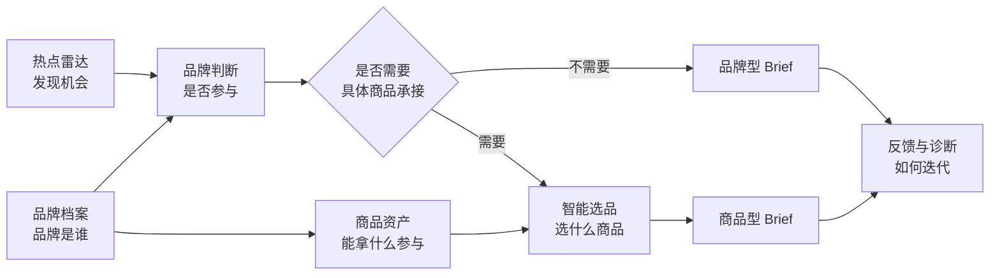

# TrendFit v0.4.0 统一营销工作台 PRD

状态：待产品确认；确认前不进入前端实现。

关联文档：

- `V0.4.0_BRAND_ASSET_PRD.md`：品牌资产与商品 Onboarding 的完整业务设计；
- `V0.4.0_BRAND_ASSET_CONTRACT.md`：品牌资产底层对象与校验规则；
- `V0.4.0_SLICE_B_DELIVERY.md`：当前品牌资产独立页面交付；
- `V0.4.0_SLICE_C_DELIVERY.md`：当前智能选品独立页面交付。

本文解决的不是新增业务能力，而是把已存在但彼此割裂的能力整合为一个可连续操作、可清楚演示的产品工作台。

## 1. 背景与问题

TrendFit 当前存在三套页面体验：

1. Radar Room：热点雷达、品牌档案、热点判断与 Brief；
2. 品牌资产：商品、Claim、Availability、Evidence 与 Snapshot；
3. 智能选品：任务配置、硬规则过滤、可解释排序与选品快照。

三者在产品逻辑上已经相关，但在界面上使用不同页面骨架和导航。用户进入品牌资产或智能选品后，难以判断自己仍处于同一个 TrendFit 工作流，也无法自然回到某个品牌、热点或 Brief 的上下文。

这会造成四个问题：

- 产品认知割裂：像三个并列 Demo，而不是一个平台；
- 工作流断点：用户需要自行记住当前品牌、热点和任务；
- 数据关系不可见：商品资产为何进入选品、选品结果如何进入 Brief 没有被串起来；
- 面试叙事偏弱：能展示页面功能，但难体现复杂 B 端平台的信息架构与链路设计能力。

## 2. 产品目标

建立一个统一的 TrendFit 营销决策工作台，让用户沿着以下主链路完成工作：



统一工作台应让用户始终能回答：

- 我当前在为哪个品牌工作；
- 我处于营销决策链的哪一步；
- 当前结论使用了哪版品牌与商品资产；
- 为什么某个商品被选择、排除或要求补证；
- 下一步可以执行什么操作。

## 3. 非目标

本次不新增以下能力：

- 不接入实时热点采集、真实广告账户或投放数据；
- 不实现文件上传、OCR 或品牌资料自动解析；
- 不训练选品模型，也不预测 CTR、CVR、GMV 或 ROI；
- 不实现账号、组织、权限、审批或云端协作；
- 不重写现有品牌资产合同和选品规则；
- 不为了视觉统一而删除已有证据、版本和风险边界。

## 4. 用户与核心场景

### 4.1 主要用户

- 品牌市场人员：管理品牌及商品事实，寻找可参与的热点；
- 策略或运营人员：根据营销目标筛选商品并生成 Brief；
- 商品运营人员：定位待审、过期、受限与证据不足的资产；
- 面试演示者：说明如何把品牌营销 Agent 抽象为商品资产驱动的平台能力。

### 4.2 核心场景

**场景 A：从热点开始**

用户在热点雷达发现机会，选择品牌完成参与判断。若热点适合用品牌态度、内容表达或品牌行动承接，可直接进入品牌型 Brief；若需要具体商品承接，则查看推荐商品与排除理由，再进入商品型 Brief。

**场景 B：从商品治理开始**

用户先在品牌资产中处理待补证或过期商品，再创建选品任务，确认合格商品是否能支持当前营销目标。

**场景 C：切换品牌对比**

用户保持同一个热点，切换奈雪、Petlibro 或 BreezeCare，观察品牌参与结论、可用商品和风险边界如何变化。

## 5. 信息架构

统一工作台采用一套全局框架和共享数据上下文。不同业务页面拥有可直接访问的地址，便于刷新恢复、分享和定位；这只是页面地址不同，不代表数据、状态或产品被拆成多个系统。

```text
TrendFit 工作台
├── 热点雷达
│   └── 首页、热点列表、热点详情、品牌参与判断
├── 品牌中心
│   ├── 品牌档案：定位、人群、目标、权限、约束、未知项
│   └── 商品资产：商品、Claim、Availability、Evidence、Snapshot
├── 决策中心
│   ├── 决策记录：品牌是否参与、理由、反对理由与补证项
│   ├── 智能选品：任务输入、规则过滤、解释排序、选品快照
│   └── Brief：品牌型 / 商品型方案、渠道、风险与退出条件
└── 反馈入口
    └── 人工保留、淘汰、补证和修改记录
```

### 5.1 一级导航

首版固定为四个一级入口：

1. 热点雷达；
2. 品牌中心；
3. 决策中心；
4. 反馈入口。

品牌档案与商品资产是品牌中心的二级视图，不再作为两个一级模块。智能选品与 Brief 是决策中心的二级视图。导航顺序表达从机会发现、资产管理、营销决策到人工反馈的闭环；当前一级模块和二级视图都必须明确高亮。

### 5.2 页面与路由原则

- 保留业务页面各自的路由，不把所有能力塞进同一个超长页面；
- 所有路由使用同一全局侧栏、顶部上下文栏和视觉规范；
- 路由只决定“用户打开哪一页”，共享 Brand、Topic、Assessment、Catalog Item、Snapshot、Brief 与 Feedback 数据源，不复制数据；
- 全局品牌上下文通过统一状态层维护，并同步到必要的 URL 参数；跳转模块不会创建另一份品牌或商品数据；
- 旧的前端内部路由可在实施时渐进迁移，不因统一工作台重写全部功能；
- 深链刷新后应恢复当前页面，并尽可能恢复品牌、热点、商品或任务上下文；
- 无法恢复的上下文显示明确空态，不静默切换到错误品牌或对象。

建议目标路由：

| 一级入口 / 二级页面 | 目标路由 | 上下文参数 |
| --- | --- | --- |
| 热点雷达 | `/` | `brand`、筛选条件 |
| 品牌中心 / 品牌档案 | `/brands` | `brand` |
| 品牌中心 / 商品资产 | `/brand-assets` | `brand`、`item` |
| 决策中心 / 智能选品 | `/selection-tasks` | `brand`、可选 `topic` / `task` |
| 热点详情 | `/trends/:id` | `brand` |
| 决策中心 / Brief | `/briefs/:id` | `brand`、`topic`、snapshot lineage |
| 反馈入口 | 全局抽屉或 `/feedback` | `brand`、关联对象 |

## 6. 统一页面框架

### 6.1 全局侧栏

侧栏承担模块切换，不承载业务筛选。每个入口包含名称和简短功能含义；不使用无法解释的图标替代文字。

侧栏底部持续显示：

- 当前为合成演示；
- 数据并非实时扫描；
- 浏览器本地修改不代表云端保存。

### 6.2 顶部上下文栏

所有核心页面共享以下上下文：

- 当前品牌；
- 当前品牌版本或资产快照；
- 当前数据状态：合成演示 / 待核验 / 已过期 / 待重评；
- 当前页面主操作。

品牌切换是全局上下文操作。切换后：

- 热点事实不变，只切换品牌判断；
- 品牌档案和商品资产切换到目标品牌；
- 智能选品清空不兼容的旧结果并要求重新生成快照；
- Brief 若没有对应品牌版本，则回到热点详情并明确提示；
- 未保存编辑仍沿用保存、放弃、取消的保护逻辑。

### 6.3 链路提示

页面顶部显示轻量流程位置：

`热点机会 → 品牌判断 →（按需选品）→ Brief → 反馈`

它是状态提示与快捷跳转，不是强制线性流程。商品选择是条件步骤，不是每个 Brief 的强制步骤；用户也可以从商品资产直接开始任务。

## 7. 核心跨页流程

### 7.1 热点详情 → Brief 或智能选品

前置条件：热点对当前品牌的判断不是“不推荐”，且数据状态允许进入下一步。

系统带入：

- brand_id 与 brand_version；
- topic_id 与 topic_version；
- assessment_id；
- 推荐场景、目标人群、风险和待补证项；
- 当前 Brand Asset Snapshot。

系统根据营销承接方式提供两个下一步：

- **创建品牌型 Brief**：适用于品牌态度、内容互动、品牌行动、场景教育等不依赖具体商品的机会；
- **进入智能选品**：适用于新品推广、商品种草、转化增长、组合促销或需要具体 Claim 承接的机会。

是否需要商品由营销目标和创意承接方式决定，不以“商品库是否恰好有匹配结果”倒推。若前置条件不满足，按钮显示具体阻塞原因，不提供形式上可点击但无法完成的操作。

### 7.2 商品资产 → 智能选品

商品资产页提供“创建选品任务”。系统带入当前品牌与资产快照，但不默认强选当前商品。当前商品可作为“重点评估对象”，仍必须通过硬规则。

### 7.3 双路径 Brief

#### 品牌型 Brief

当品牌与热点调性契合，且创意不需要具体商品承接时，即使没有匹配商品，也可以创建 Brief。它必须绑定 Topic、Assessment 与 Brand Profile 版本，并明确标记 `brand_led` 和“本方案不绑定具体商品”。

品牌型 Brief 可以使用品牌定位、价值观、内容角色和已确认的品牌级表达，但不能：

- 引用未入选商品的功能、价格、库存、渠道或商品 Claim；
- 使用强商品转化 CTA 冒充品牌传播；
- 因为没有匹配商品而自动降低商品硬规则；
- 将“无匹配商品”解释为品牌与热点不匹配。

#### 商品型 Brief

当营销目标或创意明确依赖商品时，只有已生成有效选品快照且至少一个商品入选，才可创建或更新商品型 Brief。它标记为 `product_led`，并继承：

- 选品任务目标、市场、渠道和时间窗口；
- 入选商品 ID 与版本；
- 可使用 Claim；
- 排除项与硬阻断；
- Brand Asset Snapshot 和 Selection Snapshot Key。

若商品型任务没有匹配商品，则保留空结果并提供两个明确选择：调整任务条件，或返回热点详情重新判断该机会是否适合做品牌型 Brief。系统不能自动把商品型任务改写为品牌型 Brief。

改变任务输入、品牌资产版本或入选商品后，旧快照标记失效；关联的商品型 Brief 标记 `stale`，不自动改写。品牌型 Brief 仅在其引用的 Brand Profile、Topic 或品牌级 Claim 变化时标记 `stale`，不因未引用商品变化而失效。

### 7.4 Brief → 资产回溯

商品型 Brief 中的商品、Claim 与快照都可回到对应详情；品牌型 Brief 可回到品牌档案、热点与 Assessment。历史 Brief 必须展示创建时版本，不能静默替换为最新资料。

## 8. 状态设计

### 8.1 全局状态

| 状态 | 含义 | 页面行为 |
| --- | --- | --- |
| `synthetic_demo` | 合成演示数据 | 持续展示真实性提示 |
| `ready` | 当前输入满足进入下一环节条件 | 开放主操作 |
| `needs_evidence` | 存在可补充的关键证据 | 展示缺口与补证入口 |
| `blocked` | 违反硬约束 | 禁止进入执行态并解释原因 |
| `stale` | 上游版本已变化 | 保留历史结果，要求重评 |
| `expired` | 时间或可用性已失效 | 禁止新增引用，保留历史审计 |

### 8.2 上下文冲突处理

- URL 与本地保存品牌冲突时，以明确 URL 为准；
- 商品不属于当前品牌时，不自动切换并隐藏错误，应提示并提供切换；
- 任务引用旧资产快照时，展示旧结果与版本差异，不自动重新排序；
- 空结果是合法结果，不能放松硬规则凑出推荐。
- 选品空结果不阻止独立成立的品牌型 Brief，但二者必须作为不同决策分支重新确认，不能自动降级转换。

## 9. 本次 MVP 范围

### P0：确认后实现

- 为现有三个页面接入统一侧栏与顶部上下文栏；
- 四个一级入口在所有页面中保持一致；
- 品牌档案与商品资产收拢为品牌中心的二级视图；
- 智能选品与 Brief 收拢为决策中心的二级视图；
- 全局品牌选择在页面跳转时保持；
- 商品资产与智能选品互相深链；
- Radar Room 增加商品资产和智能选品入口；
- 智能选品展示“来自热点”或“来自资产”的任务来源；
- 用明确状态展示选品快照到 Brief 的链路，即使 Brief 接入暂以演示态呈现；
- 在决策表达中区分品牌型 Brief 与商品型 Brief，品牌型 Brief 不强制绑定商品；
- 桌面和窄屏均可完成完整导航；
- 保留合成数据、非实时与无 ROI 预测提示。

### P1：下一切片

- 热点详情直接创建预填选品任务；
- 选品快照真正写入 Brief 数据对象；
- 商品或 Claim 变化触发关联 Brief `stale`；
- 全局最近任务与待处理事项；
- 面包屑与跨对象影响范围。

## 10. 关键交互规则

1. 用户切换模块时不应丢失当前品牌。
2. 用户切换品牌时不得沿用另一个品牌的商品、快照或 Brief。
3. 页面只显示数据真实支持的下一步，不出现“假生成”“假投放”按钮。
4. 选品匹配分始终标记为规则匹配度，不包装成效果预测。
5. 所有关键结论可回到 Evidence 或版本快照。
6. 被排除商品必须展示具体原因，不能只显示低分。
7. 本地演示状态与产品愿景在视觉上明确区分。
8. 无匹配商品不等于不能生成 Brief；系统应根据营销目标区分品牌型与商品型路径。

## 11. 成功指标与验收标准

本次为本地演示产品，不使用虚构业务提升指标，以任务完成和错误防护验收。

### 11.1 任务验收

- 用户从热点雷达进入商品资产或智能选品不超过 2 次操作；
- 用户从任一核心页面都能识别当前品牌和所在模块；
- 从商品资产打开智能选品时，品牌上下文准确；
- 从智能选品回到商品详情时，能定位到正确商品；
- 品牌切换后不存在上一个品牌的商品或选品结果串位；
- 深链刷新后仍能恢复目标商品；
- 窄屏下主导航、品牌切换和主操作均可用。

### 11.2 风险验收

- `blocked / expired / stale` 不可被误显示为可执行；
- 无符合条件商品时保持空结果；
- 品牌型 Brief 可以无商品，但必须绑定品牌与热点版本，且不得出现商品级事实或强转化表达；
- 商品型 Brief 必须绑定有效选品快照，不得绕过空结果；
- 合成数据不被展示为真实品牌经营事实；
- 不出现真实 ROI、实时扫描或在线模型已经运行的暗示；
- 旧 Brief 保留原快照引用，不被最新资产静默覆盖。

## 12. 面试演示脚本

1. 在热点雷达选择一个话题，说明“热点事实”和“品牌是否参与”是两层判断；
2. 切到品牌档案，说明品牌层约束如何成为决策输入；
3. 进入商品资产，展示可营销、待补证和过期商品共存；
4. 展示双路径：品牌态度型机会可直接创建品牌型 Brief，商品承接型机会进入智能选品；
5. 创建智能选品任务，先经硬规则过滤，再展示可解释排序；
6. 打开未选原因，说明平台不会为了给答案而绕过 availability 或 Claim；
7. 固化选品快照并进入商品型 Brief，展示品牌、热点、商品和版本 lineage；
8. 切换品牌，说明同一热点在不同资产与约束下得到不同结果。

核心表达：TrendFit 从“给热点写创意”升级为“以版本化品牌与商品资产为底座，完成机会判断、智能选品和受控创编的营销决策平台”。

## 13. 产品取舍

- **保留独立 URL，统一产品框架**：兼顾模块化、深链和一致体验；
- **Brief 不强制商品化**：品牌契合先于商品匹配，商品只在营销目标需要时成为硬条件；
- **先统一上下文，再扩展 AI**：避免模型能力建立在割裂、易串位的数据输入上；
- **硬规则先于智能排序**：把业务不可违反的边界交给确定性规则；
- **允许空结果与不推荐**：平台价值包含阻止错误投放；
- **快照而非永远读取最新值**：保证 Brief 可复盘、可审计；
- **P0 不做大规模重构**：先以共享框架和导航打通体验，再逐步迁移旧内部路由。

## 14. 待确认项

进入前端实现前，需要确认以下产品决定：

已确认：

1. 一级导航使用热点雷达、品牌中心、决策中心、反馈入口四个入口；
2. 品牌档案与商品资产归入品牌中心，不拆成两个一级模块；
3. 不同业务页面可以保留独立地址，但必须共享底层数据与全局品牌上下文；
4. P0 先完成导航、品牌上下文和链路表达，Brief 的完整数据接入放到 P1；
5. 统一后的默认首页继续设为热点雷达；
6. Brief 分为品牌型和商品型，没有匹配商品时仍可在条件成立的情况下创建品牌型 Brief。

进入实现前仍需最终确认：本次修订是否准确表达以上决定。

确认后才进入 HTML / React 实现与验收。
